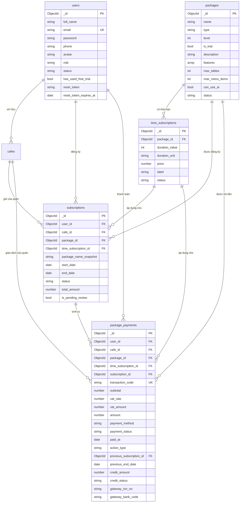
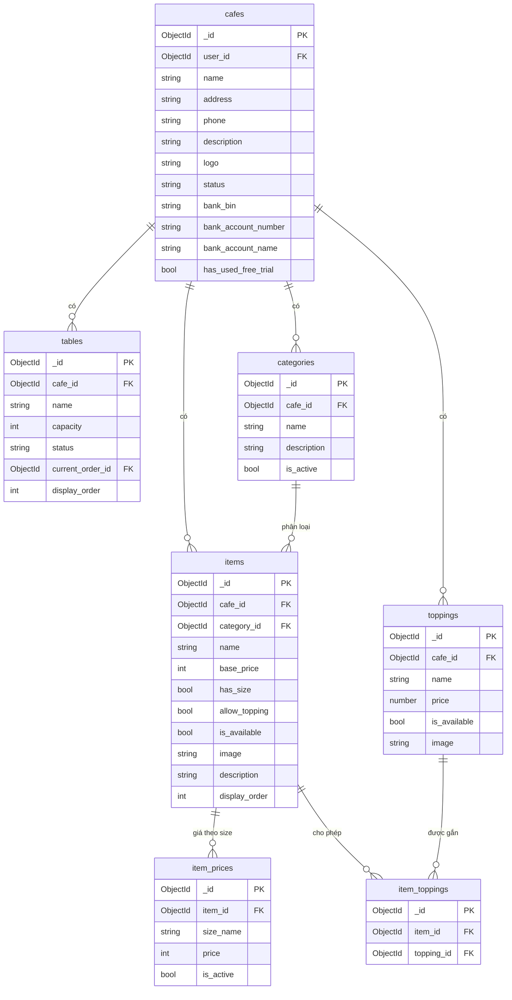
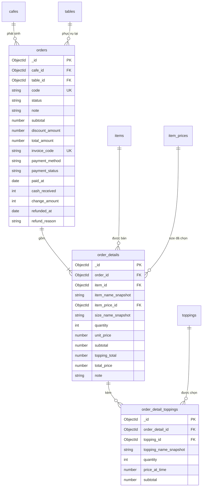
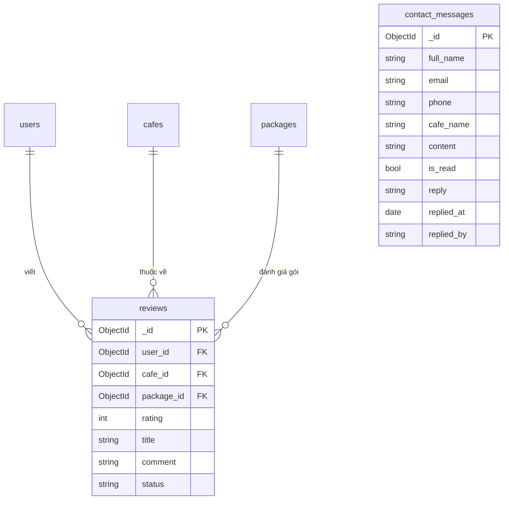

# FunCafe — Sơ đồ ERD

Cơ sở dữ liệu: **MongoDB** (database `funcafe`). Vì là NoSQL nên "khóa ngoại" ở đây là
**tham chiếu logic** — lưu `ObjectId` của document bên kia, không có ràng buộc cứng như SQL.

Ký hiệu: **PK** khóa chính · **FK** khóa ngoại · **UK** duy nhất · **NN** bắt buộc.

Sơ đồ Mermaid ở [mục 3](#3-sơ-đồ-mermaid): dán vào <https://mermaid.live> để xuất PNG/SVG.

---

## 1. Danh sách collection

| # | Collection | Vai trò |
|---|---|---|
| 1 | `users` | Tài khoản (chủ quán & quản trị viên) |
| 2 | `packages` | Gói dịch vụ (Fun Free / Pro / Pro Max) |
| 3 | `time_subscriptions` | Thời hạn & giá bán của từng gói |
| 4 | `subscriptions` | Lượt đăng ký gói của một quán |
| 5 | `package_payments` | Giao dịch thanh toán gói |
| 6 | `cafes` | Quán cafe |
| 7 | `tables` | Bàn trong quán |
| 8 | `categories` | Danh mục món |
| 9 | `items` | Món trong thực đơn |
| 10 | `item_prices` | Giá theo size của món |
| 11 | `toppings` | Topping của quán |
| 12 | `item_toppings` | Topping được phép gắn cho món (N–N) |
| 13 | `orders` | Đơn bán hàng kiêm hóa đơn |
| 14 | `order_details` | Dòng món trong đơn |
| 15 | `order_detail_toppings` | Topping của từng dòng món |
| 16 | `reviews` | Đánh giá dịch vụ FunCafe |
| 17 | `contact_messages` | Tin nhắn liên hệ từ trang công khai |

Ngoài ra có bảng `personal_access_tokens` nằm ở **SQLite** (không thuộc ERD nghiệp vụ) —
Laravel Sanctum yêu cầu một bảng quan hệ để lưu token đăng nhập.

---

## 2. Chi tiết từng collection

### 2.1 `users` — Tài khoản

| Trường | Kiểu | Ràng buộc | Ghi chú |
|---|---|---|---|
| `_id` | ObjectId | PK | |
| `full_name` | String | NN | Họ tên |
| `email` | String | UK, NN | Dùng để đăng nhập |
| `password` | String | NN | Đã băm bcrypt |
| `phone` | String | | |
| `avatar` | String | | URL ảnh đại diện |
| `role` | String | NN | `user` \| `admin` |
| `status` | String | NN | `active` \| `locked` |
| `has_used_free_trial` | Boolean | | Giữ lại từ bản một-quán; nay hạn mức dùng thử tính theo **quán** |
| `reset_token` | String | | Token đặt lại mật khẩu — không bao giờ trả ra API |
| `reset_token_expires_at` | Date | | Hạn của token trên |
| `created_at`, `updated_at` | Date | | |

### 2.2 `packages` — Gói dịch vụ

| Trường | Kiểu | Ràng buộc | Ghi chú |
|---|---|---|---|
| `_id` | ObjectId | PK | |
| `name` | String | NN | "Fun Free", "Pro", "Pro Max" |
| `type` | String | NN | `free` \| `pro` \| `promax` |
| `level` | Int | NN | 0 / 1 / 2 — dùng để so sánh nâng cấp hay hạ cấp |
| `is_trial` | Boolean | | Gói dùng thử (miễn phí, mỗi quán 1 lần) |
| `description` | String | | |
| `features` | Array\<String\> | | Danh sách gạch đầu dòng hiển thị ở trang giá |
| `max_tables` | Int \| null | | **null = không giới hạn** |
| `max_menu_items` | Int \| null | | **null = không giới hạn** |
| `can_use_ai` | Boolean | | Cho dùng trợ lý AI hay không |
| `status` | String | NN | `active` \| `inactive` |
| `created_at`, `updated_at` | Date | | |

> Thuế VAT **không** lưu ở đây — lấy từ cấu hình `funcafe.vat_rate` lúc đọc, và gói dùng thử luôn là 0%.

### 2.3 `time_subscriptions` — Thời hạn & giá

| Trường | Kiểu | Ràng buộc | Ghi chú |
|---|---|---|---|
| `_id` | ObjectId | PK | |
| `package_id` | ObjectId | FK → `packages` | |
| `duration_value` | Int | NN | |
| `duration_unit` | String | NN | `day` \| `month` |
| `price` | Number | ≥ 0 | Giá chưa gồm VAT |
| `label` | String | | Nhãn hiển thị ("1 tháng", "6 tháng"...) |
| `status` | String | | `active` \| `inactive` |
| `created_at`, `updated_at` | Date | | |

### 2.4 `subscriptions` — Lượt đăng ký gói

| Trường | Kiểu | Ràng buộc | Ghi chú |
|---|---|---|---|
| `_id` | ObjectId | PK | |
| `user_id` | ObjectId | FK → `users` | Chủ sở hữu |
| `cafe_id` | ObjectId | FK → `cafes` | **Gói tính theo QUÁN**, không theo tài khoản |
| `package_id` | ObjectId | FK → `packages` | |
| `time_subscription_id` | ObjectId | FK → `time_subscriptions` | |
| `package_name_snapshot` | String | | Tên gói lúc mua — giữ nguyên kể cả khi admin đổi tên gói |
| `start_date`, `end_date` | Date | NN | |
| `status` | String | NN | `active` \| `pending` \| `expired` \| `cancelled` |
| `total_amount` | Number | | **Tổng** tiền đã trả cho chu kỳ `start_date → end_date` (đã gồm VAT) |
| `is_pending_review` | Boolean | | Di sản của luồng duyệt tay đã gỡ — xem ghi chú dưới bảng |
| `created_at`, `updated_at` | Date | | |

> **Còn hiệu lực** = `status = 'active'` **và** `end_date > hiện tại`. Chỉ kiểm `status` là chưa đủ.

> **Không còn khâu admin duyệt.** Giao diện chỉ cho thanh toán qua VNPay, và cổng này tự kích
> hoạt gói qua callback. Trang `admin/payments` chỉ để đối soát, không có nút duyệt/từ chối.
> Vì vậy `is_pending_review` gần như luôn `false`; nhánh xử lý chuyển khoản tay trong mã nguồn
> chỉ còn ý nghĩa phòng thủ nếu sau này bật lại phương thức đó.

> Collection này mô tả **quyền dùng**, không phải chứng từ tài chính. Chi tiết tiền
> (giá chưa thuế, VAT, phương thức, mã giao dịch, loại thao tác) nằm ở `package_payments`
> — xem [quyết định #5](#5-các-quyết-định-thiết-kế-đáng-lưu-ý).
>
> Ngoại lệ duy nhất là `total_amount`, giữ lại để tính pro-rata phần còn lại của gói cũ khi
> nâng cấp. Vì gia hạn **kéo dài `end_date` trên chính document này**, `total_amount` phải
> được **cộng dồn** mỗi lần gia hạn: nếu không, số tiền của lần mua đầu sẽ bị chia cho một
> khoảng thời gian dài hơn và khách bị cấn trừ thiếu.

### 2.5 `package_payments` — Thanh toán gói

| Trường | Kiểu | Ràng buộc | Ghi chú |
|---|---|---|---|
| `_id` | ObjectId | PK | |
| `user_id` | ObjectId | FK → `users` | |
| `cafe_id` | ObjectId | FK → `cafes` | |
| `package_id` | ObjectId | FK → `packages` | |
| `time_subscription_id` | ObjectId | FK → `time_subscriptions` | |
| `subscription_id` | ObjectId | FK → `subscriptions` | |
| `transaction_code` | String | UK | Mã giao dịch `TXN-YYYYMMDD-NNNN` |
| `subtotal` | Number | | Giá gói chưa VAT |
| `vat_rate` | Number | | % VAT áp lúc mua (gói dùng thử = 0) |
| `vat_amount` | Number | | |
| `amount` | Number | | Số tiền thực trả (đã gồm VAT, đã trừ khoản cấn trừ nếu có) |
| `payment_method` | String | | Kiểm định cho phép `cash` \| `bank_transfer` \| `qr_code` \| `e_wallet` \| `vnpay`, nhưng giao diện hiện chỉ phát sinh **`vnpay`** |
| `payment_status` | String | | `pending` \| `paid` \| `failed` \| `rejected` |
| `paid_at` | Date | | |
| `note` | String | | |
| `action_type` | String | | `new` \| `renew` \| `upgrade` — **nguồn chân lý duy nhất** cho loại thao tác |
| `previous_subscription_id` | ObjectId | FK → `subscriptions` | Gói bị thay thế khi nâng cấp |
| `previous_end_date` | Date | | Hạn cũ trước khi gia hạn, dùng để rollback nếu giao dịch bị từ chối |
| `credit_amount` | Number | | Giá trị còn lại của gói cũ được **cấn trừ thẳng** vào giá gói mới khi nâng cấp |
| `credit_status` | String | | `none` \| `applied` — hệ thống tự tính, **không có duyệt tay** |
| `gateway_txn_no` | String | | Mã giao dịch phía cổng thanh toán |
| `gateway_bank_code` | String | | Ngân hàng khách dùng |
| `created_at`, `updated_at` | Date | | |

> Cặp `credit_*` **không phải hoàn tiền mặt**: khi nâng cấp giữa kỳ, phần thời gian chưa dùng
> của gói cũ được trừ thẳng vào hóa đơn gói mới, khách chỉ trả phần chênh lệch.
>
> `user_id` và `cafe_id` suy được từ `subscription_id`, nhưng vẫn lưu trực tiếp — đây là
> denormalize có chủ đích để màn hình đối soát của admin lọc theo quán/chủ quán mà không phải join.

### 2.6 `cafes` — Quán cafe

| Trường | Kiểu | Ràng buộc | Ghi chú |
|---|---|---|---|
| `_id` | ObjectId | PK | |
| `user_id` | ObjectId | FK → `users` | Chủ quán |
| `name` | String | NN | |
| `address`, `phone`, `description` | String | | |
| `logo` | String | | URL ảnh |
| `status` | String | | `active` \| `inactive` |
| `bank_bin` | String | | Mã ngân hàng (VietQR) |
| `bank_account_number` | String | | Số tài khoản nhận tiền khách trả |
| `bank_account_name` | String | | Tên chủ tài khoản |
| `has_used_free_trial` | Boolean | | Mỗi quán chỉ được dùng thử Fun Free **một lần** |
| `created_at`, `updated_at` | Date | | |

### 2.7 `tables` — Bàn

| Trường | Kiểu | Ràng buộc | Ghi chú |
|---|---|---|---|
| `_id` | ObjectId | PK | |
| `cafe_id` | ObjectId | FK → `cafes` | |
| `name` | String | NN | "Bàn 1", "VIP 2"... |
| `capacity` | Int | | Số chỗ ngồi |
| `status` | String | NN | `empty` \| `serving` |
| `current_order_id` | ObjectId | FK → `orders` | Đơn đang phục vụ tại bàn (null khi bàn trống) |
| `display_order` | Int | | Thứ tự hiển thị |
| `created_at`, `updated_at` | Date | | |

### 2.8 `categories` — Danh mục món

| Trường | Kiểu | Ràng buộc | Ghi chú |
|---|---|---|---|
| `_id` | ObjectId | PK | |
| `cafe_id` | ObjectId | FK → `cafes` | |
| `name` | String | NN | |
| `description` | String | | |
| `is_active` | Boolean | | Chỉ được **ẩn**, không xóa — xóa sẽ làm các món bên trong mồ côi |
| `created_at`, `updated_at` | Date | | |

### 2.9 `items` — Món

| Trường | Kiểu | Ràng buộc | Ghi chú |
|---|---|---|---|
| `_id` | ObjectId | PK | |
| `cafe_id` | ObjectId | FK → `cafes` | |
| `category_id` | ObjectId | FK → `categories` | |
| `name` | String | NN | |
| `base_price` | Int | ≥ 0 | Giá dùng khi món **không** chia size |
| `has_size` | Boolean | | Có chia size hay không |
| `allow_topping` | Boolean | | Có cho gắn topping hay không |
| `is_available` | Boolean | | Chỉ được **ẩn**, không xóa — món đã bán còn nằm trong hóa đơn cũ |
| `image` | String | | URL ảnh |
| `description` | String | | |
| `display_order` | Int | | |
| `created_at`, `updated_at` | Date | | |

### 2.10 `item_prices` — Giá theo size

| Trường | Kiểu | Ràng buộc | Ghi chú |
|---|---|---|---|
| `_id` | ObjectId | PK | |
| `item_id` | ObjectId | FK → `items` | |
| `size_name` | String | NN | "S" / "M" / "L" — **lưu thẳng tên**, không có collection `sizes` riêng |
| `price` | Int | ≥ 0 | |
| `is_active` | Boolean | | |
| `created_at`, `updated_at` | Date | | |

> Không tách bảng `sizes` vì tên size chỉ có ý nghĩa trong phạm vi một món:
> size "L" của ly cà phê và của phần bánh là hai thứ khác nhau.

### 2.11 `toppings` — Topping

| Trường | Kiểu | Ràng buộc | Ghi chú |
|---|---|---|---|
| `_id` | ObjectId | PK | |
| `cafe_id` | ObjectId | FK → `cafes` | |
| `name` | String | NN | |
| `price` | Number | ≥ 0 | |
| `is_available` | Boolean | | Chỉ được ẩn, không xóa |
| `image` | String | | |
| `created_at`, `updated_at` | Date | | |

### 2.12 `item_toppings` — Món ↔ Topping (N–N)

| Trường | Kiểu | Ràng buộc | Ghi chú |
|---|---|---|---|
| `_id` | ObjectId | PK | |
| `item_id` | ObjectId | FK → `items` | |
| `topping_id` | ObjectId | FK → `toppings` | |
| `created_at`, `updated_at` | Date | | |

### 2.13 `orders` — Đơn bán hàng kiêm hóa đơn

| Trường | Kiểu | Ràng buộc | Ghi chú |
|---|---|---|---|
| `_id` | ObjectId | PK | |
| `cafe_id` | ObjectId | FK → `cafes` | |
| `table_id` | ObjectId | FK → `tables` | |
| `code` | String | UK theo quán | Mã đơn `ORD-YYYYMMDD-NNNN` |
| `status` | String | NN | `active` \| `paid` \| `cancelled` |
| `note` | String | | |
| `subtotal` | Number | | Tổng tiền các dòng món |
| `discount_amount` | Number | | Không vượt quá `subtotal` |
| `total_amount` | Number | ≥ 0 | `subtotal − discount_amount` |
| `invoice_code` | String | UK theo quán | Mã phiếu `INV-YYYYMMDD-NNNN`, cấp khi thanh toán |
| `payment_method` | String | | `cash` \| `vietqr` |
| `payment_status` | String | | `paid` \| `refunded` |
| `paid_at` | Date | | |
| `cash_received` | Int | | Tiền khách đưa (chỉ với tiền mặt) |
| `change_amount` | Int | | Tiền thối lại |
| `refunded_at` | Date | | |
| `refund_reason` | String | | Bắt buộc khi hoàn tiền |
| `created_at`, `updated_at` | Date | | |

> Không có collection `invoices` riêng: hóa đơn **chính là** đơn hàng ở trạng thái đã thanh toán.
> Tách ra thành hai bảng sẽ sinh nguy cơ đơn và hóa đơn lệch nhau.
> Đơn `payment_status = 'refunded'` bị **loại khỏi doanh thu**.

### 2.14 `order_details` — Dòng món trong đơn

| Trường | Kiểu | Ràng buộc | Ghi chú |
|---|---|---|---|
| `_id` | ObjectId | PK | |
| `order_id` | ObjectId | FK → `orders` | |
| `item_id` | ObjectId | FK → `items` | |
| `item_name_snapshot` | String | NN | Tên món lúc bán |
| `item_price_id` | ObjectId | FK → `item_prices` | Size đã chọn (null nếu món không chia size) |
| `size_name_snapshot` | String | | Tên size lúc bán |
| `quantity` | Int | ≥ 1 | |
| `unit_price` | Number | | Đơn giá lúc bán, **lấy từ CSDL** chứ không tin giá client gửi lên |
| `subtotal` | Number | | `unit_price × quantity` |
| `topping_total` | Number | | Tổng tiền topping của dòng này |
| `total_price` | Number | | `subtotal + topping_total` |
| `note` | String | | |
| `created_at`, `updated_at` | Date | | |

> Các trường `*_snapshot` tồn tại để hóa đơn cũ **không đổi nội dung** khi chủ quán
> sửa tên hoặc giá món về sau.

### 2.15 `order_detail_toppings` — Topping của dòng món

| Trường | Kiểu | Ràng buộc | Ghi chú |
|---|---|---|---|
| `_id` | ObjectId | PK | |
| `order_detail_id` | ObjectId | FK → `order_details` | |
| `topping_id` | ObjectId | FK → `toppings` | |
| `topping_name_snapshot` | String | | |
| `quantity` | Int | ≥ 1 | |
| `price_at_time` | Number | | Giá topping lúc bán |
| `subtotal` | Number | | `price_at_time × quantity` |
| `created_at`, `updated_at` | Date | | |

### 2.16 `reviews` — Đánh giá dịch vụ FunCafe

| Trường | Kiểu | Ràng buộc | Ghi chú |
|---|---|---|---|
| `_id` | ObjectId | PK | |
| `user_id` | ObjectId | FK → `users` | Người đánh giá |
| `cafe_id` | ObjectId | FK → `cafes` | Quán của người đánh giá |
| `package_id` | ObjectId | FK → `packages` | Gói đang dùng lúc đánh giá |
| `rating` | Int | 1–5 | |
| `title` | String | | |
| `comment` | String | | |
| `status` | String | | `visible` \| `hidden` — admin bật/tắt hiển thị ở trang chủ |
| `created_at`, `updated_at` | Date | | |

### 2.17 `contact_messages` — Tin nhắn liên hệ

| Trường | Kiểu | Ràng buộc | Ghi chú |
|---|---|---|---|
| `_id` | ObjectId | PK | |
| `full_name` | String | NN | |
| `email` | String | NN | Nơi nhận email trả lời |
| `phone` | String | | |
| `cafe_name` | String | | |
| `content` | String | NN | |
| `is_read` | Boolean | | |
| `reply` | String | | Nội dung admin đã trả lời |
| `replied_at` | Date | | |
| `replied_by` | String | | Tên admin đã trả lời |
| `created_at`, `updated_at` | Date | | |

> Không có khóa ngoại tới `users`: người gửi là **khách vãng lai** chưa có tài khoản.

---

## 3. Sơ đồ Mermaid

Chia làm 4 cụm cho dễ đọc và dễ in. Dán từng khối vào <https://mermaid.live>.

### 3.1 Cụm A — Tài khoản & Gói dịch vụ

### 3.2 Cụm B — Quán & Thực đơn

### 3.3 Cụm C — Bán hàng

### 3.4 Cụm D — Đánh giá & Liên hệ

---

## 4. Bảng bản số quan hệ

| Quan hệ | Bản số | Diễn giải |
|---|---|---|
| `users` → `cafes` | 1 : 0..n | Một tài khoản mở được nhiều quán |
| `users` → `subscriptions` | 1 : 0..n | |
| `users` → `package_payments` | 1 : 0..n | |
| `users` → `reviews` | 1 : 0..n | |
| `cafes` → `subscriptions` | 1 : 0..n | Mỗi quán có lịch sử gói riêng; tối đa **một** gói còn hiệu lực tại một thời điểm |
| `cafes` → `tables` / `categories` / `items` / `toppings` / `orders` | 1 : 0..n | |
| `packages` → `time_subscriptions` | 1 : 1..n | Mỗi gói trả phí có ít nhất một mốc thời hạn |
| `packages` → `subscriptions` | 1 : 0..n | |
| `time_subscriptions` → `subscriptions` | 1 : 0..n | |
| `subscriptions` → `package_payments` | 1 : 1..n | Đăng ký mới và nâng cấp tạo subscription **mới**; gia hạn **tái dùng** subscription cũ và chỉ thêm một giao dịch — đó là lý do quan hệ này là 1:n chứ không phải 1:1 |
| `categories` → `items` | 1 : 0..n | |
| `items` → `item_prices` | 1 : 0..n | 0 khi món không chia size |
| `items` ↔ `toppings` | n : n | Nối qua `item_toppings` |
| `tables` → `orders` | 1 : 0..n | Một bàn có nhiều đơn theo thời gian, nhưng chỉ **một** đơn `active` |
| `orders` → `order_details` | 1 : 1..n | Đơn luôn có ít nhất một dòng món |
| `order_details` → `order_detail_toppings` | 1 : 0..n | |
| `items` → `order_details` | 1 : 0..n | |
| `toppings` → `order_detail_toppings` | 1 : 0..n | |
| `contact_messages` | — | Độc lập, không nối với collection nào |

---

## 5. Các quyết định thiết kế đáng lưu ý

1. **Không có collection `invoices`.** Hóa đơn là chính đơn hàng ở trạng thái đã thanh toán
   (`status = 'paid'`, có `invoice_code`). Tách hai bảng chỉ tạo thêm nguy cơ số liệu lệch nhau.

2. **Không có collection `sizes`.** Tên size lưu thẳng vào `item_prices.size_name`, vì size
   chỉ có nghĩa trong phạm vi một món.

3. **Ảnh chụp dữ liệu (`*_snapshot`) trong đơn hàng.** Tên món, tên size, tên topping và đơn
   giá đều được sao lại lúc bán, nên hóa đơn cũ giữ nguyên nội dung dù thực đơn có đổi về sau.

4. **Gói dịch vụ gắn với QUÁN, không gắn với tài khoản.** `subscriptions.cafe_id` là trường
   quyết định: một người mở nhiều quán thì mỗi quán mua gói riêng, và hạn mức dùng thử
   Fun Free tính theo `cafes.has_used_free_trial`.

5. **`subscriptions` và `package_payments` KHÔNG gộp, nhưng cũng không chép dữ liệu của nhau.**
   Đây là điểm khác biệt so với quyết định #1: `orders` gộp được hóa đơn vào vì mỗi đơn chỉ
   thanh toán một lần, còn một subscription có thể phát sinh **nhiều** giao dịch (gia hạn tái
   dùng chính subscription đó). Vì vậy hai collection tồn tại song song với vai trò tách bạch:

   | | `subscriptions` | `package_payments` |
   |---|---|---|
   | Trả lời câu hỏi | *Quán này đang được dùng gì, tới bao giờ?* | *Đã trả bao nhiêu tiền, khi nào, bằng cách nào?* |
   | Vòng đời | Một dòng cho mỗi chu kỳ quyền dùng | Một dòng cho mỗi lần trả tiền |

   Trước đây `subscriptions` còn giữ thêm bản sao của `subtotal`, `vat_rate`, `vat_amount`,
   `action_type`, `previous_subscription_id`. Không nơi nào đọc chúng, nhưng bản sao vẫn kịp
   gây hại: `total_amount` không được cập nhật khi gia hạn nên tiền cấn trừ lúc nâng cấp bị
   tính thiếu. Các trường đó đã được gỡ; giờ mỗi con số chỉ có **một** nơi giữ sự thật.
