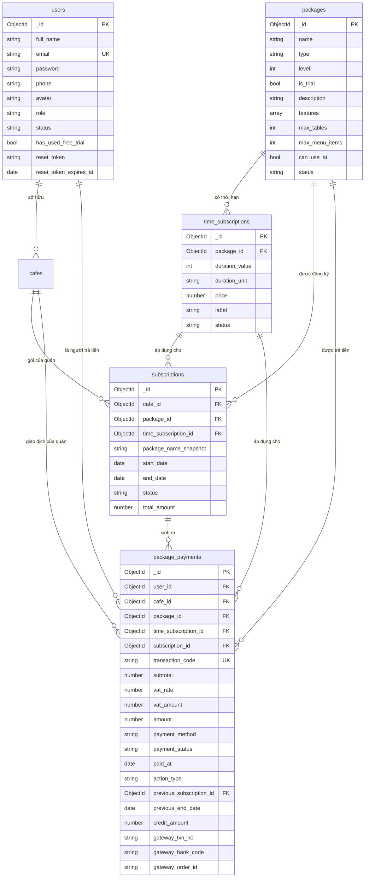
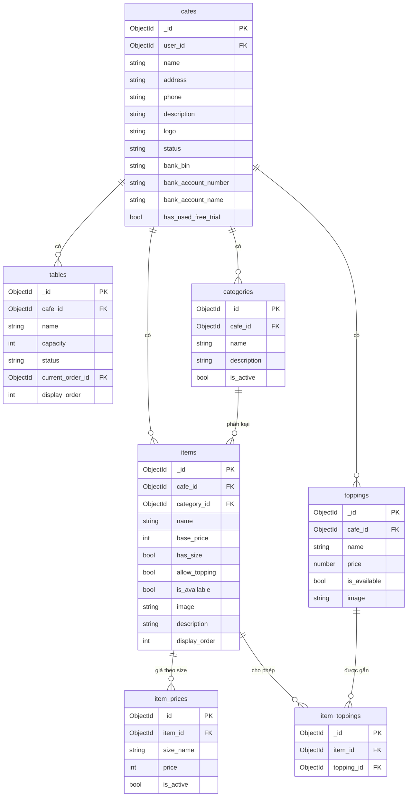
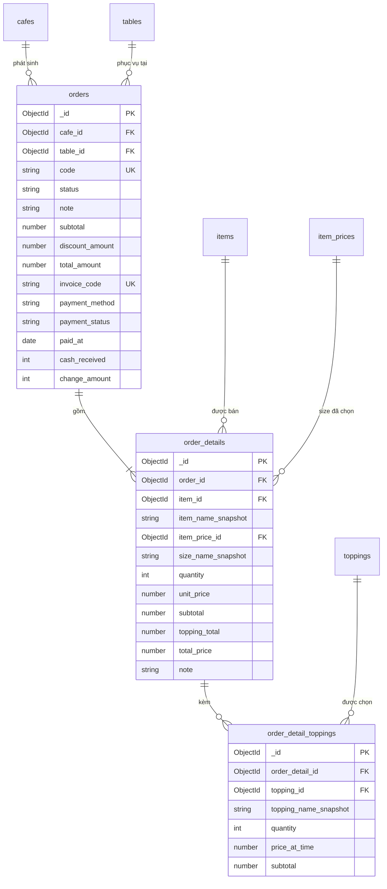
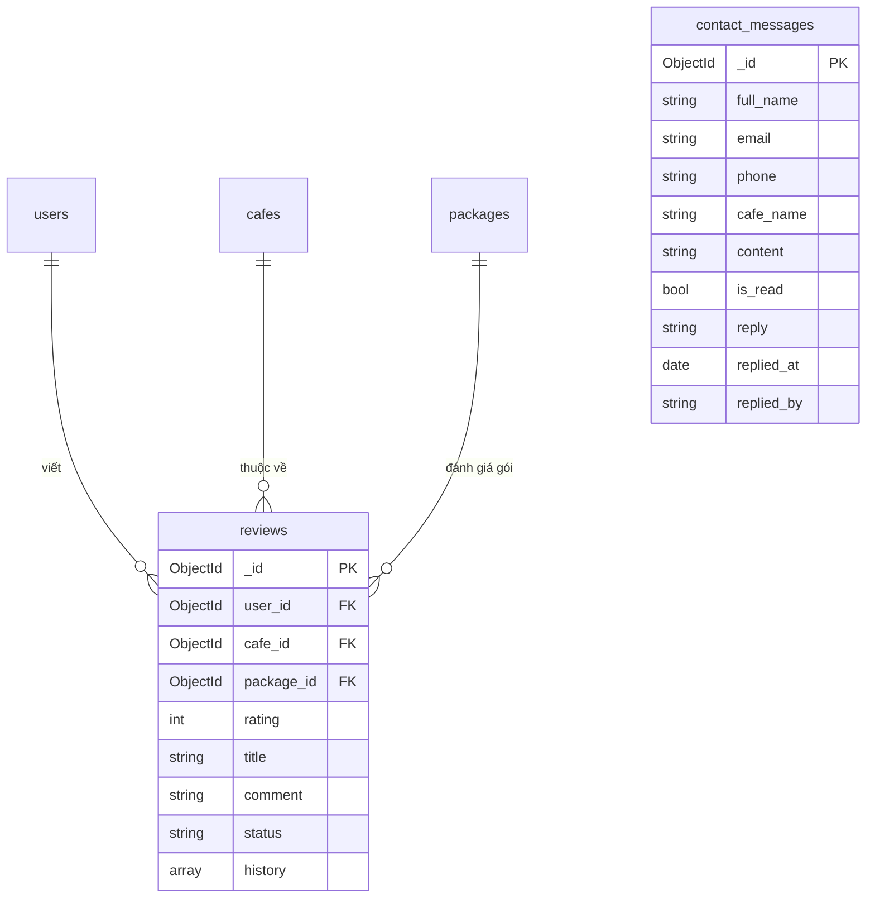

# FunCafe — Sơ đồ ERD

Cơ sở dữ liệu: **MongoDB** (database `funcafe`). Vì là NoSQL nên "khóa ngoại" ở đây là
**tham chiếu logic** — lưu `ObjectId` của document bên kia, không có ràng buộc cứng như SQL.

Ký hiệu: **PK** khóa chính · **FK** khóa ngoại · **UK** duy nhất · **NN** bắt buộc.

**Về `created_at` / `updated_at`:** mọi collection đều có hai trường này do Laravel tự sinh và
quản lý. Bảng chi tiết ở mục 2 có liệt kê để đủ, nhưng các sơ đồ Mermaid ở mục 3 **cố ý lược bỏ**
— chúng là dấu vết kỹ thuật, không mang ý nghĩa nghiệp vụ, vẽ vào chỉ làm sơ đồ rối. Các mốc thời
gian **có** ý nghĩa nghiệp vụ thì vẫn giữ trong sơ đồ: `orders.paid_at`, `subscriptions.start_date`
/`end_date`, `package_payments.paid_at`, `contact_messages.replied_at`.

Sơ đồ Mermaid ở [mục 3](#3-sơ-đồ-mermaid): dán vào <https://mermaid.live> để xuất PNG/SVG.

---

## 1. Danh sách collection

| # | Collection | Vai trò |
|---|---|---|
| 1 | `users` | Tài khoản (chủ quán & quản trị viên) |
| 2 | `packages` | Gói dịch vụ (Fun Free / Pro / Pro Max) |
| 3 | `time_subscriptions` | Thời hạn & giá bán của từng gói |
| 4 | `subscriptions` | Lượt đăng ký gói của một quán |
| 5 | `package_payments` | Giao dịch thanh toán gói |
| 6 | `cafes` | Quán cafe |
| 7 | `tables` | Bàn trong quán |
| 8 | `categories` | Danh mục món |
| 9 | `items` | Món trong thực đơn |
| 10 | `item_prices` | Giá theo size của món |
| 11 | `toppings` | Topping của quán |
| 12 | `item_toppings` | Topping được phép gắn cho món (N–N) |
| 13 | `orders` | Đơn bán hàng kiêm hóa đơn |
| 14 | `order_details` | Dòng món trong đơn |
| 15 | `order_detail_toppings` | Topping của từng dòng món |
| 16 | `reviews` | Đánh giá dịch vụ FunCafe |
| 17 | `contact_messages` | Tin nhắn liên hệ từ trang công khai |

Ngoài ra có bảng `personal_access_tokens` nằm ở **SQLite** (không thuộc ERD nghiệp vụ) —
Laravel Sanctum yêu cầu một bảng quan hệ để lưu token đăng nhập.

---

## 2. Chi tiết từng collection

### 2.1 `users` — Tài khoản

| Trường | Kiểu | Ràng buộc | Ghi chú |
|---|---|---|---|
| `_id` | ObjectId | PK | |
| `full_name` | String | NN | Họ tên |
| `email` | String | UK, NN | Dùng để đăng nhập |
| `password` | String | NN | Đã băm bcrypt |
| `phone` | String | | |
| `avatar` | String | | URL ảnh đại diện |
| `role` | String | NN | `user` \| `admin` |
| `status` | String | NN | `active` \| `locked` |
| `has_used_free_trial` | Boolean | | Tài khoản này đã nhận gói dùng thử Fun Free chưa. Xem ghi chú bên dưới — cờ này đi **cặp** với `cafes.has_used_free_trial` |
| `reset_token` | String | | **Bản băm SHA-256** của token đặt lại mật khẩu; bản thô chỉ đi qua email. Không bao giờ trả ra API |
| `reset_token_expires_at` | Date | | Hạn của token trên (1 giờ) |
| `created_at`, `updated_at` | Date | | |

> **Dùng thử miễn phí bị chặn ở HAI cấp, cả hai đều cần.**
> `cafes.has_used_free_trial` lo "một quán không xin dùng thử hai lần".
> `users.has_used_free_trial` lo "một tài khoản không xin dùng thử hai lần" — thiếu vế này thì
> chủ quán chỉ cần tạo quán mới là lại có 7 ngày Pro Max, lặp vô hạn, vì số quán mỗi tài khoản
> tạo được không bị giới hạn. Cả hai cờ được đặt cùng lúc ở `SubscriptionController::store()`
> và `SubscriptionActivator::markPaidAndActivate()`.

> **`reset_token` lưu dạng băm.** Trước đây lưu nguyên văn: ai chạm được dữ liệu (bản sao lưu,
> tài khoản đọc CSDL, kết xuất chẩn đoán) là chiếm được mọi tài khoản đang có yêu cầu đặt lại
> trong vòng một giờ. Nay chỉ bản băm nằm trong CSDL, `resetPassword` so khớp bằng bản băm.

### 2.2 `packages` — Gói dịch vụ

| Trường | Kiểu | Ràng buộc | Ghi chú |
|---|---|---|---|
| `_id` | ObjectId | PK | |
| `name` | String | NN | "Fun Free", "Pro", "Pro Max" |
| `type` | String | NN | `free` \| `pro` \| `promax` |
| `level` | Int | NN | 0 / 1 / 2 — dùng để so sánh nâng cấp hay hạ cấp |
| `is_trial` | Boolean | | Gói dùng thử (miễn phí, mỗi quán 1 lần) |
| `description` | String | | |
| `features` | Array\<String\> | | Danh sách gạch đầu dòng hiển thị ở trang giá |
| `max_tables` | Int \| null | | **null = không giới hạn** |
| `max_menu_items` | Int \| null | | **null = không giới hạn** |
| `can_use_ai` | Boolean | | Cho dùng trợ lý AI hay không |
| `status` | String | NN | `active` \| `inactive` |
| `created_at`, `updated_at` | Date | | |

> Thuế VAT **không** lưu ở đây — lấy từ cấu hình `funcafe.vat_rate` lúc đọc, và gói dùng thử luôn là 0%.

### 2.3 `time_subscriptions` — Thời hạn & giá

| Trường | Kiểu | Ràng buộc | Ghi chú |
|---|---|---|---|
| `_id` | ObjectId | PK | |
| `package_id` | ObjectId | FK → `packages` | |
| `duration_value` | Int | NN | |
| `duration_unit` | String | NN | `day` \| `month` |
| `price` | Number | ≥ 0 | Giá chưa gồm VAT |
| `label` | String | | Nhãn hiển thị ("1 tháng", "6 tháng"...) |
| `status` | String | | `active` \| `inactive` |
| `created_at`, `updated_at` | Date | | |

### 2.4 `subscriptions` — Lượt đăng ký gói

| Trường | Kiểu | Ràng buộc | Ghi chú |
|---|---|---|---|
| `_id` | ObjectId | PK | |
| `cafe_id` | ObjectId | FK → `cafes` | **Gói tính theo QUÁN**, không theo tài khoản |
| `package_id` | ObjectId | FK → `packages` | |
| `time_subscription_id` | ObjectId | FK → `time_subscriptions` | |
| `package_name_snapshot` | String | | Tên gói lúc mua — giữ nguyên kể cả khi admin đổi tên gói |
| `start_date`, `end_date` | Date | NN | |
| `status` | String | NN | `active` \| `pending` \| `cancelled` |
| `total_amount` | Number | | **Tổng** tiền đã trả cho chu kỳ `start_date → end_date` (đã gồm VAT) |
| `created_at`, `updated_at` | Date | | |

> **Không có `user_id`.** Chủ sở hữu suy từ `cafe_id → cafes.user_id`. Mọi truy vấn gói trong
> hệ thống đều lọc theo `cafe_id` (middleware kiểm hạn, hạn mức gói, trang doanh thu, màn admin),
> không nơi nào đọc chủ sở hữu trực tiếp từ đây — giữ thêm một bản sao chỉ tạo ra nguồn sự thật
> thứ hai có thể lệch. So sánh với `package_payments`, nơi `user_id` **được giữ** vì lý do khác:
> đó là chứng từ tài chính và màn hình admin thật sự lọc theo người trả tiền.

> **Không có trạng thái `expired`.** Không có tiến trình nền nào đổi `status` khi hết hạn, nên gói
> quá hạn vẫn mang `status = 'active'`. **Còn hiệu lực** = `status = 'active'` **và**
> `end_date > hiện tại` — chỉ kiểm `status` là sai.

> **Không còn khâu admin duyệt.** Giao diện cho chọn một trong hai cổng VNPay hoặc MoMo, và cả
> hai cổng đều tự kích hoạt gói qua callback. Trang `admin/payments` chỉ để đối soát, không có nút duyệt/từ chối.
> Trạng thái chờ được suy trực tiếp từ `status` (`pending`), nên cờ `is_pending_review` cũ
> đã được gỡ bỏ.

> Collection này mô tả **quyền dùng**, không phải chứng từ tài chính. Chi tiết tiền
> (giá chưa thuế, VAT, phương thức, mã giao dịch, loại thao tác) nằm ở `package_payments`
> — xem [quyết định #5](#5-các-quyết-định-thiết-kế-đáng-lưu-ý).
>
> Ngoại lệ duy nhất là `total_amount`, giữ lại để tính pro-rata phần còn lại của gói cũ khi
> nâng cấp. Vì gia hạn **kéo dài `end_date` trên chính document này**, `total_amount` phải
> được **cộng dồn** mỗi lần gia hạn: nếu không, số tiền của lần mua đầu sẽ bị chia cho một
> khoảng thời gian dài hơn và khách bị cấn trừ thiếu.

### 2.5 `package_payments` — Thanh toán gói

| Trường | Kiểu | Ràng buộc | Ghi chú |
|---|---|---|---|
| `_id` | ObjectId | PK | |
| `user_id` | ObjectId | FK → `users` | **Người trả tiền** — xem ghi chú cuối mục |
| `cafe_id` | ObjectId | FK → `cafes` | Quán được cấp quyền dùng |
| `package_id` | ObjectId | FK → `packages` | |
| `time_subscription_id` | ObjectId | FK → `time_subscriptions` | |
| `subscription_id` | ObjectId | FK → `subscriptions` | |
| `transaction_code` | String | UK | Mã giao dịch `TXN-YYYYMMDD-NNNN` |
| `subtotal` | Number | | Giá gói chưa VAT |
| `vat_rate` | Number | | % VAT áp lúc mua (gói dùng thử = 0) |
| `vat_amount` | Number | | |
| `amount` | Number | | Số tiền thực trả (đã gồm VAT, đã trừ khoản cấn trừ nếu có) |
| `payment_method` | String | | Kiểm định cho phép `cash` \| `bank_transfer` \| `qr_code` \| `e_wallet` \| `vnpay`, nhưng giao diện hiện chỉ phát sinh **`vnpay`** và **`momo`** |
| `payment_status` | String | | `pending` \| `paid` \| `failed` \| `rejected` |
| `paid_at` | Date | | |
| `note` | String | | |
| `action_type` | String | | `new` \| `renew` \| `upgrade` — **nguồn chân lý duy nhất** cho loại thao tác |
| `previous_subscription_id` | ObjectId | FK → `subscriptions` | Gói bị thay thế khi nâng cấp |
| `previous_end_date` | Date | | Hạn cũ trước khi gia hạn, dùng để rollback nếu giao dịch bị từ chối |
| `credit_amount` | Number | | Giá trị còn lại của gói cũ được **cấn trừ thẳng** vào giá gói mới khi nâng cấp (0 nếu không có). Lưu như dòng biên lai; "đã cấn trừ" suy từ `credit_amount > 0` nên không cần cờ trạng thái riêng |
| `gateway_txn_no` | String | | Mã giao dịch phía cổng thanh toán |
| `gateway_bank_code` | String | | Ngân hàng khách dùng |
| `gateway_order_id` | String | | Mã đơn **đã gửi sang cổng** khi nó khác `transaction_code`. Cần cho MoMo: MoMo bắt mã đơn duy nhất theo mã đối tác, mà mã đối tác của môi trường thử nghiệm là dùng chung — trong khi `transaction_code` lại đếm theo từng CSDL nên máy local và máy production cùng sinh ra `TXN-<ngày>-0001`. Gửi kèm đuôi ngẫu nhiên và lưu lại đây để callback tra đúng đơn |
| `created_at`, `updated_at` | Date | | |

> `credit_amount` **không phải hoàn tiền mặt**: khi nâng cấp giữa kỳ, phần thời gian chưa dùng
> của gói cũ được trừ thẳng vào hóa đơn gói mới, khách chỉ trả phần chênh lệch.
>
> `cafe_id` suy được từ `subscription_id`, và `user_id` suy được thêm một bậc nữa qua
> `cafes.user_id` — nhưng cả hai vẫn lưu thẳng ở đây. Đây là **denormalize có chủ đích**, không
> phải lỗi chuẩn hóa: MongoDB không có JOIN, mà màn hình quản trị cần lọc giao dịch theo người
> trả tiền (`Admin\UserController` gom tổng chi tiêu của từng tài khoản bằng một truy vấn duy
> nhất trên `user_id`). Bỏ đi thì mỗi lần đều phải lấy danh sách quán của user trước rồi mới lọc
> giao dịch — thêm một vòng đi CSDL để lấy lại thứ đã có sẵn.
>
> Đây cũng là lý do `subscriptions` **bỏ** `user_id` còn `package_payments` **giữ**: một bên là
> bảng trạng thái quyền dùng (luôn tra theo quán), một bên là chứng từ tài chính (tra theo người trả).

### 2.6 `cafes` — Quán cafe

| Trường | Kiểu | Ràng buộc | Ghi chú |
|---|---|---|---|
| `_id` | ObjectId | PK | |
| `user_id` | ObjectId | FK → `users` | Chủ quán |
| `name` | String | NN | |
| `address`, `phone`, `description` | String | | |
| `logo` | String | | URL ảnh |
| `status` | String | | `open` \| `closed` \| `inactive` — mặc định `open`; quán **không xóa được**, chỉ đổi trạng thái |
| `bank_bin` | String | | Mã ngân hàng (VietQR) |
| `bank_account_number` | String | | Số tài khoản nhận tiền khách trả |
| `bank_account_name` | String | | Tên chủ tài khoản |
| `has_used_free_trial` | Boolean | | Mỗi quán chỉ được dùng thử Fun Free **một lần**. Đi cặp với `users.has_used_free_trial` — xem ghi chú ở mục 2.1 |
| `created_at`, `updated_at` | Date | | |

### 2.7 `tables` — Bàn

| Trường | Kiểu | Ràng buộc | Ghi chú |
|---|---|---|---|
| `_id` | ObjectId | PK | |
| `cafe_id` | ObjectId | FK → `cafes` | |
| `name` | String | NN | "Bàn 1", "VIP 2"... |
| `capacity` | Int | | Số chỗ ngồi |
| `status` | String | NN | `empty` \| `serving` — **bộ nhớ đệm**, xem ghi chú dưới |
| `current_order_id` | ObjectId | FK → `orders` | Đơn đang phục vụ tại bàn (null khi bàn trống) — **bộ nhớ đệm** |
| `display_order` | Int | | Thứ tự hiển thị |
| `created_at`, `updated_at` | Date | | |

> **`status` và `current_order_id` KHÔNG phải nguồn chân lý.** Nguồn chân lý là: có tồn tại đơn
> `status = 'active'` trỏ vào bàn này hay không. Hai trường trên chỉ là bản sao cho tiện hiển thị.
>
> Vì sao bản sao đó lệch được: MongoDB đang chạy **standalone** nên `RunsAtomically::atomic()`
> là no-op — **không có transaction thật**. `OrderController::pay()` và `cancel()` cập nhật đơn
> ở một lệnh ghi rồi cập nhật bàn ở lệnh khác; lệnh thứ hai hỏng là bàn kẹt ở `serving` trong khi
> chẳng còn đơn nào mở. Nhân viên thấy "bàn ma": tô màu đang phục vụ, bấm vào thì giỏ rỗng.
>
> Vì vậy màn hình Bán hàng **dẫn xuất lại** trạng thái bàn từ danh sách đơn đang mở
> (`tablesLive` trong `src/app/user/sales/page.tsx`) thay vì đọc thẳng hai trường này. Lệch bao
> nhiêu cũng tự biến mất sau một lần tải lại. Backend vẫn ghi hai trường để trang Quản lý bàn
> và lần tải đầu có sẵn giá trị.

### 2.8 `categories` — Danh mục món

| Trường | Kiểu | Ràng buộc | Ghi chú |
|---|---|---|---|
| `_id` | ObjectId | PK | |
| `cafe_id` | ObjectId | FK → `cafes` | |
| `name` | String | NN | |
| `description` | String | | |
| `is_active` | Boolean | | Chỉ được **ẩn**, không xóa — xóa sẽ làm các món bên trong mồ côi |
| `created_at`, `updated_at` | Date | | |

### 2.9 `items` — Món

| Trường | Kiểu | Ràng buộc | Ghi chú |
|---|---|---|---|
| `_id` | ObjectId | PK | |
| `cafe_id` | ObjectId | FK → `cafes` | |
| `category_id` | ObjectId | FK → `categories` | |
| `name` | String | NN | |
| `base_price` | Int | ≥ 0 | Giá dùng khi món **không** chia size |
| `has_size` | Boolean | | Có chia size hay không |
| `allow_topping` | Boolean | | Có cho gắn topping hay không |
| `is_available` | Boolean | | Chỉ được **ẩn**, không xóa — món đã bán còn nằm trong hóa đơn cũ |
| `image` | String | | URL ảnh |
| `description` | String | | |
| `display_order` | Int | | |
| `created_at`, `updated_at` | Date | | |

### 2.10 `item_prices` — Giá theo size

| Trường | Kiểu | Ràng buộc | Ghi chú |
|---|---|---|---|
| `_id` | ObjectId | PK | |
| `item_id` | ObjectId | FK → `items` | |
| `size_name` | String | NN | "S" / "M" / "L" — **lưu thẳng tên**, không có collection `sizes` riêng |
| `price` | Int | ≥ 0 | |
| `is_active` | Boolean | | |
| `created_at`, `updated_at` | Date | | |

> Không tách bảng `sizes` vì tên size chỉ có ý nghĩa trong phạm vi một món:
> size "L" của ly cà phê và của phần bánh là hai thứ khác nhau.

### 2.11 `toppings` — Topping

| Trường | Kiểu | Ràng buộc | Ghi chú |
|---|---|---|---|
| `_id` | ObjectId | PK | |
| `cafe_id` | ObjectId | FK → `cafes` | |
| `name` | String | NN | |
| `price` | Number | ≥ 0 | |
| `is_available` | Boolean | | Chỉ được ẩn, không xóa |
| `image` | String | | |
| `created_at`, `updated_at` | Date | | |

### 2.12 `item_toppings` — Món ↔ Topping (N–N)

| Trường | Kiểu | Ràng buộc | Ghi chú |
|---|---|---|---|
| `_id` | ObjectId | PK | |
| `item_id` | ObjectId | FK → `items` | |
| `topping_id` | ObjectId | FK → `toppings` | |
| `created_at`, `updated_at` | Date | | |

### 2.13 `orders` — Đơn bán hàng kiêm hóa đơn

| Trường | Kiểu | Ràng buộc | Ghi chú |
|---|---|---|---|
| `_id` | ObjectId | PK | |
| `cafe_id` | ObjectId | FK → `cafes` | |
| `table_id` | ObjectId | FK → `tables` | |
| `code` | String | UK theo quán | Mã đơn `ORD-YYYYMMDD-NNNN` |
| `status` | String | NN | `active` \| `paid` \| `cancelled` |
| `note` | String | | |
| `subtotal` | Number | | Tổng tiền các dòng món |
| `discount_amount` | Number | | Thu ngân nhập ở màn hình thanh toán. Backend luôn kẹp lại `min(giá trị gửi lên, subtotal)` nên `total_amount` không bao giờ âm — không tin con số client gửi |
| `total_amount` | Number | ≥ 0 | `subtotal − discount_amount` |
| `invoice_code` | String | UK theo quán | Mã phiếu `INV-YYYYMMDD-NNNN`, cấp khi thanh toán |
| `payment_method` | String | | `cash` \| `vietqr` — chỉ có khi đã thanh toán |
| `payment_status` | String | | `paid` — **trường chỉ xuất hiện khi đơn đã thanh toán**, đơn đang phục vụ không có trường này |
| `paid_at` | Date | | Mốc tính doanh thu |
| `cash_received` | Int | | Tiền khách đưa (chỉ với tiền mặt) |
| `change_amount` | Int | | Tiền thối lại |
| `created_at`, `updated_at` | Date | | |

> Không có collection `invoices` riêng: hóa đơn **chính là** đơn hàng ở trạng thái đã thanh toán.
> Tách ra thành hai bảng sẽ sinh nguy cơ đơn và hóa đơn lệch nhau.
> Doanh thu chỉ tính các đơn `payment_status = 'paid'`. Hệ thống **không có nghiệp vụ hoàn tiền**
> cho đơn bán hàng — đơn lỡ tay thì hủy (`status = 'cancelled'`) trước khi thanh toán.

### 2.14 `order_details` — Dòng món trong đơn

| Trường | Kiểu | Ràng buộc | Ghi chú |
|---|---|---|---|
| `_id` | ObjectId | PK | |
| `order_id` | ObjectId | FK → `orders` | |
| `item_id` | ObjectId | FK → `items` | |
| `item_name_snapshot` | String | NN | Tên món lúc bán |
| `item_price_id` | ObjectId | FK → `item_prices` | Size đã chọn (null nếu món không chia size) |
| `size_name_snapshot` | String | | Tên size lúc bán |
| `quantity` | Int | ≥ 1 | |
| `unit_price` | Number | | Đơn giá lúc bán, **lấy từ CSDL** chứ không tin giá client gửi lên |
| `subtotal` | Number | | `unit_price × quantity` |
| `topping_total` | Number | | Tổng tiền topping của dòng này |
| `total_price` | Number | | `subtotal + topping_total` |
| `note` | String | | |
| `created_at`, `updated_at` | Date | | |

> Các trường `*_snapshot` tồn tại để hóa đơn cũ **không đổi nội dung** khi chủ quán
> sửa tên hoặc giá món về sau.

> **`subtotal`, `topping_total`, `total_price` KHÔNG phải giá trị dẫn xuất tính lại được.**
> Nhìn công thức thì đúng là suy ra được từ `unit_price × quantity` và các dòng
> `order_detail_toppings` — nhưng chỉ suy đúng **bằng dữ liệu của hôm bán**. Giá món và giá
> topping đổi theo thời gian, nên tính lại bằng bảng giá hôm nay sẽ ra con số khác với tờ hóa
> đơn đã in cho khách. Đây là **số tiền đã thực thu**, cùng loại với các trường `*_snapshot`.
>
> Chúng cũng đang được đọc thật, không phải chỉ ghi cho có: `total_price` là nguồn tính doanh
> thu theo món ở `AiController::buildRevenueStats()` và ở bảng "món bán chạy" của trang Doanh thu
> (`computeTopItems` trong `src/app/user/revenue/page.tsx`).

### 2.15 `order_detail_toppings` — Topping của dòng món

| Trường | Kiểu | Ràng buộc | Ghi chú |
|---|---|---|---|
| `_id` | ObjectId | PK | |
| `order_detail_id` | ObjectId | FK → `order_details` | |
| `topping_id` | ObjectId | FK → `toppings` | |
| `topping_name_snapshot` | String | | |
| `quantity` | Int | ≥ 1 | |
| `price_at_time` | Number | | Giá topping lúc bán |
| `subtotal` | Number | | `price_at_time × quantity` |
| `created_at`, `updated_at` | Date | | |

### 2.16 `reviews` — Đánh giá dịch vụ FunCafe

| Trường | Kiểu | Ràng buộc | Ghi chú |
|---|---|---|---|
| `_id` | ObjectId | PK | |
| `user_id` | ObjectId | FK → `users` | Người đánh giá |
| `cafe_id` | ObjectId | FK → `cafes` | Quán của người đánh giá |
| `package_id` | ObjectId | FK → `packages` | Gói đang dùng lúc đánh giá |
| `rating` | Int | 1–5 | |
| `title` | String | | |
| `comment` | String | | |
| `status` | String | | `visible` \| `hidden` — admin bật/tắt hiển thị ở trang chủ |
| `history` | Array\<Object\> | | **Mảng lồng** các bản đánh giá cũ đã bị ghi đè (xem dưới) |
| `created_at`, `updated_at` | Date | | `updated_at` là lần sửa gần nhất |

> **Mỗi chủ quán chỉ có MỘT đánh giá cho mỗi quán** — gửi lại là cập nhật (upsert theo cặp
> `user_id + cafe_id`), không sinh document mới. Vì đánh giá có thể đang hiển thị công khai
> ở trang giới thiệu, bản bị ghi đè được đẩy vào `history` để admin đối chiếu khi có khiếu nại
> hoặc khi ai đó sửa từ 5 sao xuống 1 sao. Giữ tối đa **20** bản gần nhất; bấm cập nhật mà không
> đổi gì thì không sinh mốc mới.
>
> Mỗi phần tử `history[]`: `rating`, `title`, `comment`, `package_id`, `written_at` (thời điểm
> bản đó được viết), `replaced_at` (thời điểm bị thay). Đây là **mảng lồng chứ không phải
> collection riêng**: số bản nhỏ và có trần, luôn đọc kèm đánh giá, không bao giờ truy vấn độc lập.

### 2.17 `contact_messages` — Tin nhắn liên hệ

| Trường | Kiểu | Ràng buộc | Ghi chú |
|---|---|---|---|
| `_id` | ObjectId | PK | |
| `full_name` | String | NN | |
| `email` | String | NN | Nơi nhận email trả lời |
| `phone` | String | | |
| `cafe_name` | String | | |
| `content` | String | NN | |
| `is_read` | Boolean | | |
| `reply` | String | | Nội dung admin đã trả lời |
| `replied_at` | Date | | |
| `replied_by` | String | | Tên admin đã trả lời — **ảnh chụp tên**, không phải khóa ngoại (xem dưới) |
| `created_at`, `updated_at` | Date | | |

> Không có khóa ngoại tới `users`: người gửi là **khách vãng lai** chưa có tài khoản.

> **`replied_by` cố ý lưu chuỗi tên chứ không phải `ObjectId`.** Nó cùng loại với các trường
> `*_snapshot` ở đơn hàng: ghi lại *ai đã trả lời tại thời điểm đó*. Chuẩn hóa thành khóa ngoại
> thì bản ghi lịch sử sẽ đổi theo khi admin đổi tên, và mất luôn thông tin nếu tài khoản đó bị
> xóa — trong khi đây là dấu vết cần giữ nguyên để đối chiếu về sau.

---

## 3. Sơ đồ Mermaid

Chia làm 4 cụm cho dễ đọc và dễ in. Dán từng khối vào <https://mermaid.live>.

> ⚠️ **Sơ đồ dưới đây chỉ liệt kê TÊN TRƯỜNG.** Ràng buộc, ý nghĩa nghiệp vụ và lý do tồn tại
> của những trường trông có vẻ trùng lặp đều nằm ở chỗ khác: bảng chi tiết ở **mục 2**, các
> quyết định thiết kế ở **mục 5–6**, chỉ mục ở **mục 7**.
>
> Đọc riêng phần sơ đồ rất dễ kết luận nhầm rằng thiết kế bị thừa. Ba cặp hay bị hiểu lầm nhất:
> `users.has_used_free_trial` + `cafes.has_used_free_trial` (mục 2.1),
> `subscriptions.total_amount` + `package_payments.amount` (quyết định #5),
> và các trường tiền đã tính sẵn ở `order_details` (mục 2.14). Cả ba đều **cố ý**.

### 3.1 Cụm A — Tài khoản & Gói dịch vụ


```mermaid
erDiagram
    users ||--o{ cafes : "sở hữu"
    users ||--o{ package_payments : "là người trả tiền"

    packages ||--o{ time_subscriptions : "có thời hạn"
    packages ||--o{ subscriptions : "được đăng ký"
    packages ||--o{ package_payments : "được trả tiền"

    time_subscriptions ||--o{ subscriptions : "áp dụng cho"
    time_subscriptions ||--o{ package_payments : "áp dụng cho"

    cafes ||--o{ subscriptions : "gói của quán"
    cafes ||--o{ package_payments : "giao dịch của quán"

    subscriptions ||--o{ package_payments : "sinh ra"

    users {
        ObjectId _id PK
        string full_name
        string email UK
        string password
        string phone
        string avatar
        string role
        string status
        bool has_used_free_trial
        string reset_token
        date reset_token_expires_at
    }
    packages {
        ObjectId _id PK
        string name
        string type
        int level
        bool is_trial
        string description
        array features
        int max_tables
        int max_menu_items
        bool can_use_ai
        string status
    }
    time_subscriptions {
        ObjectId _id PK
        ObjectId package_id FK
        int duration_value
        string duration_unit
        number price
        string label
        string status
    }
    subscriptions {
        ObjectId _id PK
        ObjectId cafe_id FK
        ObjectId package_id FK
        ObjectId time_subscription_id FK
        string package_name_snapshot
        date start_date
        date end_date
        string status
        number total_amount
    }
    package_payments {
        ObjectId _id PK
        ObjectId user_id FK
        ObjectId cafe_id FK
        ObjectId package_id FK
        ObjectId time_subscription_id FK
        ObjectId subscription_id FK
        string transaction_code UK
        number subtotal
        number vat_rate
        number vat_amount
        number amount
        string payment_method
        string payment_status
        date paid_at
        string action_type
        ObjectId previous_subscription_id FK
        date previous_end_date
        number credit_amount
        string gateway_txn_no
        string gateway_bank_code
        string gateway_order_id
    }
```

### 3.2 Cụm B — Quán & Thực đơn


```mermaid
erDiagram
    cafes ||--o{ tables : "có"
    cafes ||--o{ categories : "có"
    cafes ||--o{ items : "có"
    cafes ||--o{ toppings : "có"

    categories ||--o{ items : "phân loại"
    items ||--o{ item_prices : "giá theo size"
    items ||--o{ item_toppings : "cho phép"
    toppings ||--o{ item_toppings : "được gắn"

    cafes {
        ObjectId _id PK
        ObjectId user_id FK
        string name
        string address
        string phone
        string description
        string logo
        string status
        string bank_bin
        string bank_account_number
        string bank_account_name
        bool has_used_free_trial
    }
    tables {
        ObjectId _id PK
        ObjectId cafe_id FK
        string name
        int capacity
        string status
        ObjectId current_order_id FK
        int display_order
    }
    categories {
        ObjectId _id PK
        ObjectId cafe_id FK
        string name
        string description
        bool is_active
    }
    items {
        ObjectId _id PK
        ObjectId cafe_id FK
        ObjectId category_id FK
        string name
        int base_price
        bool has_size
        bool allow_topping
        bool is_available
        string image
        string description
        int display_order
    }
    item_prices {
        ObjectId _id PK
        ObjectId item_id FK
        string size_name
        int price
        bool is_active
    }
    toppings {
        ObjectId _id PK
        ObjectId cafe_id FK
        string name
        number price
        bool is_available
        string image
    }
    item_toppings {
        ObjectId _id PK
        ObjectId item_id FK
        ObjectId topping_id FK
    }
```

### 3.3 Cụm C — Bán hàng


```mermaid
erDiagram
    cafes ||--o{ orders : "phát sinh"
    tables ||--o{ orders : "phục vụ tại"
    orders ||--|{ order_details : "gồm"
    items ||--o{ order_details : "được bán"
    item_prices ||--o{ order_details : "size đã chọn"
    order_details ||--o{ order_detail_toppings : "kèm"
    toppings ||--o{ order_detail_toppings : "được chọn"

    orders {
        ObjectId _id PK
        ObjectId cafe_id FK
        ObjectId table_id FK
        string code UK
        string status
        string note
        number subtotal
        number discount_amount
        number total_amount
        string invoice_code UK
        string payment_method
        string payment_status
        date paid_at
        int cash_received
        int change_amount
    }
    order_details {
        ObjectId _id PK
        ObjectId order_id FK
        ObjectId item_id FK
        string item_name_snapshot
        ObjectId item_price_id FK
        string size_name_snapshot
        int quantity
        number unit_price
        number subtotal
        number topping_total
        number total_price
        string note
    }
    order_detail_toppings {
        ObjectId _id PK
        ObjectId order_detail_id FK
        ObjectId topping_id FK
        string topping_name_snapshot
        int quantity
        number price_at_time
        number subtotal
    }
```

### 3.4 Cụm D — Đánh giá & Liên hệ


```mermaid
erDiagram
    users ||--o{ reviews : "viết"
    cafes ||--o{ reviews : "thuộc về"
    packages ||--o{ reviews : "đánh giá gói"

    reviews {
        ObjectId _id PK
        ObjectId user_id FK
        ObjectId cafe_id FK
        ObjectId package_id FK
        int rating
        string title
        string comment
        string status
        array history
    }
    contact_messages {
        ObjectId _id PK
        string full_name
        string email
        string phone
        string cafe_name
        string content
        bool is_read
        string reply
        date replied_at
        string replied_by
    }
```

---

## 4. Bảng bản số quan hệ

| Quan hệ | Bản số | Diễn giải |
|---|---|---|
| `users` → `cafes` | 1 : 0..n | Một tài khoản mở được nhiều quán |
| `users` → `package_payments` | 1 : 0..n | Người trả tiền; **không** có quan hệ trực tiếp `users` → `subscriptions` |
| `users` → `reviews` | 1 : 0..n | |
| `cafes` → `subscriptions` | 1 : 0..n | Mỗi quán có lịch sử gói riêng; tối đa **một** gói còn hiệu lực tại một thời điểm |
| `cafes` → `tables` / `categories` / `items` / `toppings` / `orders` | 1 : 0..n | |
| `packages` → `time_subscriptions` | 1 : 1..n | Mỗi gói trả phí có ít nhất một mốc thời hạn |
| `packages` → `subscriptions` | 1 : 0..n | |
| `time_subscriptions` → `subscriptions` | 1 : 0..n | |
| `subscriptions` → `package_payments` | 1 : 1..n | Đăng ký mới và nâng cấp tạo subscription **mới**; gia hạn **tái dùng** subscription cũ và chỉ thêm một giao dịch — đó là lý do quan hệ này là 1:n chứ không phải 1:1 |
| `categories` → `items` | 1 : 0..n | |
| `items` → `item_prices` | 1 : 0..n | 0 khi món không chia size |
| `items` ↔ `toppings` | n : n | Nối qua `item_toppings` |
| `tables` → `orders` | 1 : 0..n | Một bàn có nhiều đơn theo thời gian, nhưng chỉ **một** đơn `active` |
| `orders` → `order_details` | 1 : 1..n | Đơn luôn có ít nhất một dòng món |
| `order_details` → `order_detail_toppings` | 1 : 0..n | |
| `items` → `order_details` | 1 : 0..n | |
| `toppings` → `order_detail_toppings` | 1 : 0..n | |
| `contact_messages` | — | Độc lập, không nối với collection nào |

---

## 5. Các quyết định thiết kế đáng lưu ý

1. **Không có collection `invoices`.** Hóa đơn là chính đơn hàng ở trạng thái đã thanh toán
   (`status = 'paid'`, có `invoice_code`). Tách hai bảng chỉ tạo thêm nguy cơ số liệu lệch nhau.

2. **Không có collection `sizes`.** Tên size lưu thẳng vào `item_prices.size_name`, vì size
   chỉ có nghĩa trong phạm vi một món.

3. **Ảnh chụp dữ liệu (`*_snapshot`) trong đơn hàng.** Tên món, tên size, tên topping và đơn
   giá đều được sao lại lúc bán, nên hóa đơn cũ giữ nguyên nội dung dù thực đơn có đổi về sau.

4. **Gói dịch vụ gắn với QUÁN, không gắn với tài khoản.** `subscriptions.cafe_id` là trường
   quyết định: một người mở nhiều quán thì mỗi quán mua gói riêng.

   Riêng **hạn mức dùng thử là ngoại lệ có chủ đích**: nó chặn ở cả hai cấp
   (`cafes.has_used_free_trial` **và** `users.has_used_free_trial`). Chỉ tính theo quán thì
   quy tắc "Fun Free một lần" bị vô hiệu — hết 7 ngày cứ tạo quán mới là lại có 7 ngày nữa,
   vì số quán một tài khoản tạo được không bị giới hạn.

5. **`subscriptions` và `package_payments` KHÔNG gộp, nhưng cũng không chép dữ liệu của nhau.**
   Đây là điểm khác biệt so với quyết định #1: `orders` gộp được hóa đơn vào vì mỗi đơn chỉ
   thanh toán một lần, còn một subscription có thể phát sinh **nhiều** giao dịch (gia hạn tái
   dùng chính subscription đó). Vì vậy hai collection tồn tại song song với vai trò tách bạch:

   | | `subscriptions` | `package_payments` |
   |---|---|---|
   | Trả lời câu hỏi | *Quán này đang được dùng gì, tới bao giờ?* | *Đã trả bao nhiêu tiền, khi nào, bằng cách nào?* |
   | Vòng đời | Một dòng cho mỗi chu kỳ quyền dùng | Một dòng cho mỗi lần trả tiền |

   Trước đây `subscriptions` còn giữ thêm bản sao của `subtotal`, `vat_rate`, `vat_amount`,
   `action_type`, `previous_subscription_id`. Không nơi nào đọc chúng, nhưng bản sao vẫn kịp
   gây hại: `total_amount` không được cập nhật khi gia hạn nên tiền cấn trừ lúc nâng cấp bị
   tính thiếu. Các trường đó đã được gỡ; giờ mỗi con số chỉ có **một** nơi giữ sự thật.

6. **Đã dọn các trường "chết" (write-only, không nơi nào đọc để chạy logic).**
   - `subscriptions.user_id` — chủ sở hữu suy được qua `cafe_id → cafes.user_id`, và mọi truy vấn
     gói đều lọc theo `cafe_id`. Trường này bị ghi vào chỉ vì code tạo bản ghi đi qua quan hệ
     `$user->subscriptions()->create(...)`, tức là hệ quả của cách viết chứ không phải chủ ý
     thiết kế. Đã đổi sang `Subscription::create(...)` và gỡ luôn quan hệ `User::subscriptions()`.
   - `subscriptions.is_pending_review` — di sản của luồng admin duyệt tay đã gỡ; trạng thái
     chờ nay suy trực tiếp từ `status = 'pending'`.
   - `package_payments.credit_status` (`none`/`applied`) — suy được trực tiếp từ
     `credit_amount > 0`, nên bỏ cờ, chỉ giữ `credit_amount` như dòng biên lai.

   Các trường **chỉ ghi nhưng là chứng từ tài chính** thì GIỮ lại (không phải "thừa"):
   `subtotal`/`vat_rate`/`vat_amount` (bảng phân tách thuế của hóa đơn), `credit_amount`,
   `gateway_txn_no`/`gateway_bank_code` (dấu vết đối soát với cổng thanh toán).

---

## 7. Chỉ mục (index)

MongoDB **không đi qua migration của Laravel** — thư mục `database/migrations/` chỉ chứa mấy
bảng SQLite cho token Sanctum và cache. Vì vậy chỉ mục được khai báo ở đúng một nơi:
`app/Console/Commands/CreateMongoIndexes.php`, chạy bằng

```bash
php artisan db:indexes
```

Lệnh này nằm trong `Dockerfile` ngay sau `migrate`, và chạy lại được nhiều lần (Mongo bỏ qua
chỉ mục đã tồn tại y hệt).

### 7.1 Chỉ mục DUY NHẤT — chốt chặn cuối cho mã chứng từ

| Collection | Khóa | Ghi chú |
|---|---|---|
| `orders` | `cafe_id` + `code` | Mã đơn duy nhất **theo từng quán** |
| `orders` | `cafe_id` + `invoice_code` | Mã hóa đơn; dùng `partialFilterExpression` cho `invoice_code` kiểu chuỗi |
| `package_payments` | `transaction_code` | Duy nhất toàn hệ thống |
| `users` | `email` | |

> **Vì sao bắt buộc phải có.** Mã đơn / hóa đơn / giao dịch được sinh bằng `count() + 1` rồi dò
> tới số chưa dùng. Vòng dò đó chỉ **thu hẹp** khe hở chứ không đóng được: hai request song song
> cùng đọc `count()`, cùng thấy mã chưa tồn tại, rồi cùng ghi. Chỉ ràng buộc ở tầng CSDL mới chặn thật.

> **Vì sao chỉ mục hóa đơn cần `partialFilterExpression`.** Đơn chưa thanh toán không có
> `invoice_code`, mà MongoDB coi "thiếu trường" là **một giá trị**. Chỉ mục duy nhất thông thường
> sẽ chỉ cho phép đúng **một** đơn chưa thanh toán trên toàn hệ thống.

### 7.2 Chỉ mục tra cứu

| Collection | Khóa | Phục vụ truy vấn |
|---|---|---|
| `orders` | `cafe_id` + `status` | Màn hình Bán hàng (đơn đang phục vụ), trang Hóa đơn (đơn đã trả tiền) |
| `orders` | `cafe_id` + `paid_at` ↓ | Doanh thu và biểu đồ lọc theo khoảng ngày |
| `order_details` | `order_id` | Nạp dòng món của đơn |
| `order_detail_toppings` | `order_detail_id` | Nạp topping của dòng món |
| `subscriptions` | `cafe_id` + `status` + `end_date` ↓ | Mọi chốt chặn gói: `CheckSubscription`, `EnforcesPackageLimits`, `RequiresAI` |
| `package_payments` | `gateway_order_id` | Callback của cổng tra đơn theo mã đã gửi đi |
| `package_payments` | `cafe_id` + `payment_status`, `user_id` + `payment_status` | Lịch sử thanh toán, bảng đối soát của admin |
| `cafes` | `user_id` | Danh sách quán của một tài khoản |
| `items`, `categories`, `toppings`, `tables` | `cafe_id` | Dữ liệu vận hành theo quán |
| `item_prices`, `item_toppings` | `item_id` | Size và topping gắn với món |
| `reviews` | `user_id`; `status` + `created_at` ↓ | Đánh giá của tôi; danh sách công khai |
| `users` | `reset_token` | Tra token lúc đặt lại mật khẩu |
| `contact_messages` | `created_at` ↓ | Danh sách liên hệ, mới nhất trước |

### 7.3 Đọc kết quả lệnh

Mỗi dòng log có một trong ba dạng:

| Dạng | Nghĩa | Cần làm gì |
|---|---|---|
| `tạo mới` | Chỉ mục vừa được dựng | Không |
| `sẵn có` | Đã có chỉ mục **cùng bộ khóa** (kể cả khi tên khác) | Không |
| `LỖI` / `KHAC` | Chưa dựng được | Xem bên dưới |

> **Đối chiếu theo KHÓA, không theo tên.** Một số chỉ mục duy nhất được tạo tay ở các phiên
> trước mang tên khác (`uniq_cafe_code`, `uniq_txn`). MongoDB coi hai chỉ mục cùng khóa nhưng
> khác tên là **xung đột** và ném lỗi, nên nếu lệnh chỉ gọi `createIndex` rồi bắt lỗi thì nó sẽ
> báo lỗi ở mọi lần chạy. Lệnh đọc danh sách chỉ mục hiện có và so theo bộ khóa để việc gọi lại
> luôn vô hại.

> **`LỖI` kèm "duplicate key" là trường hợp cần xử lý thật:** CSDL đang có bản ghi trùng mã đơn /
> mã hóa đơn / mã giao dịch, nên ràng buộc duy nhất không dựng được. Phải dọn bản ghi trùng rồi
> chạy lại. **`KHAC`** nghĩa là đã có chỉ mục cùng khóa nhưng **không** duy nhất — xóa chỉ mục cũ
> rồi chạy lại.
>
> Lệnh cố ý **không dừng và luôn trả về thành công**: nó chạy lúc container khởi động, một chỉ
> mục hỏng không được phép chặn cả ứng dụng lên.
