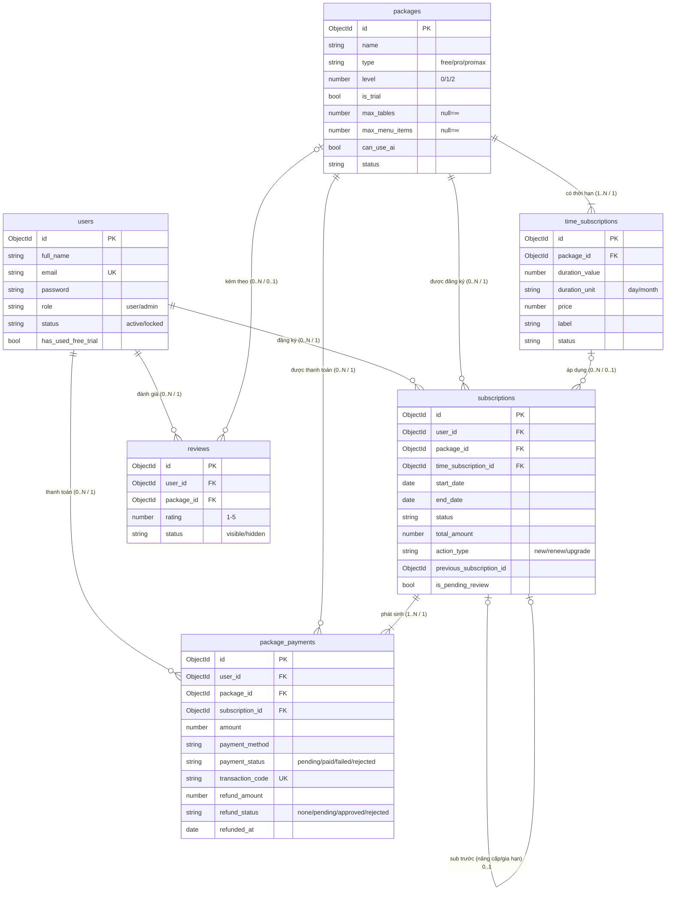
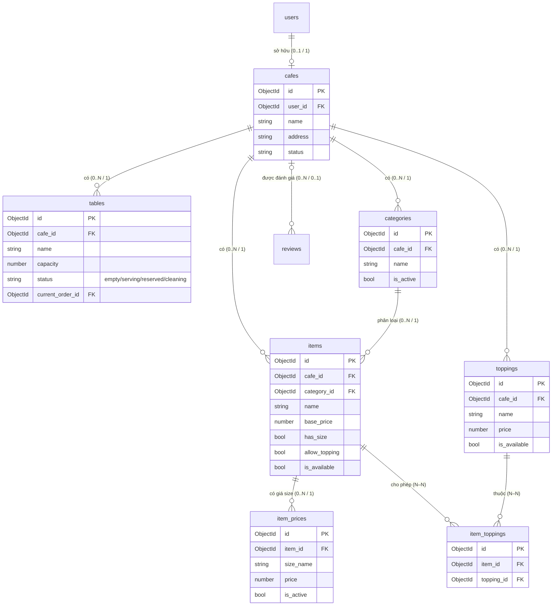
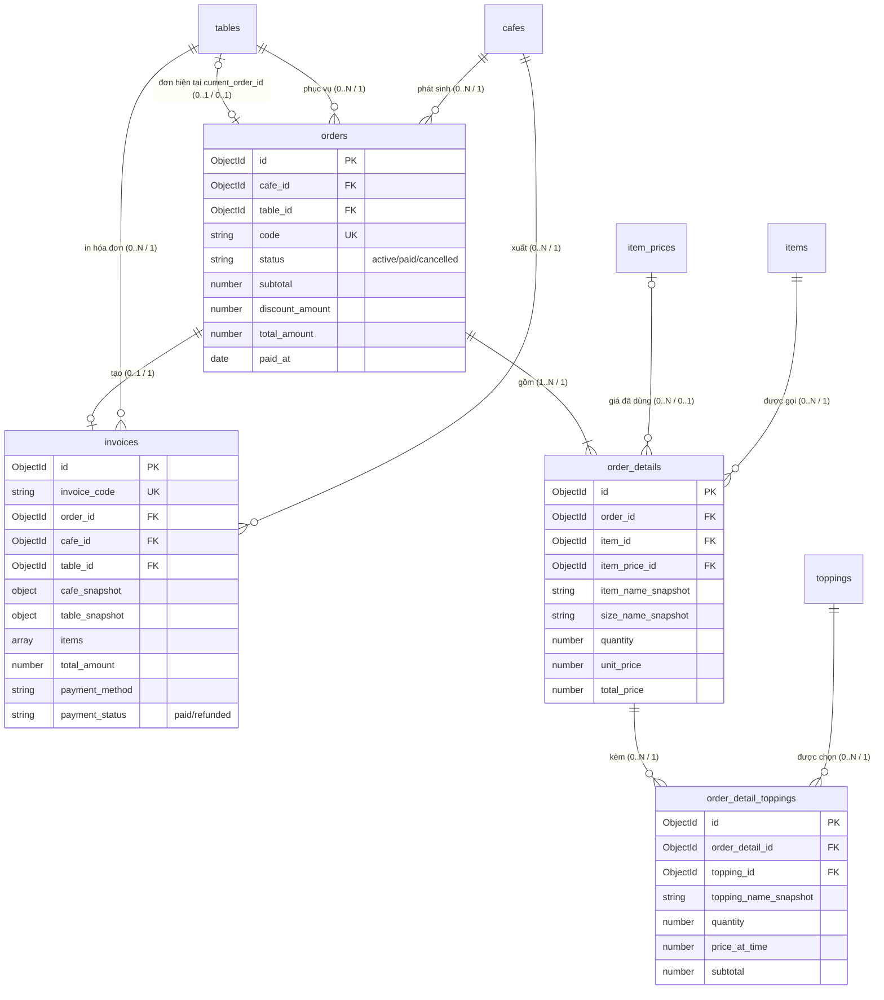
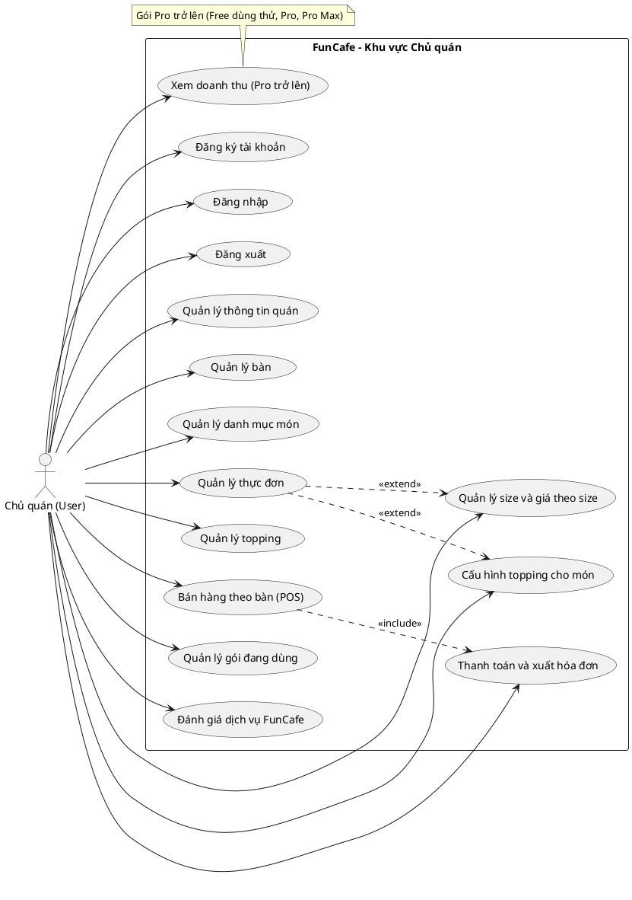
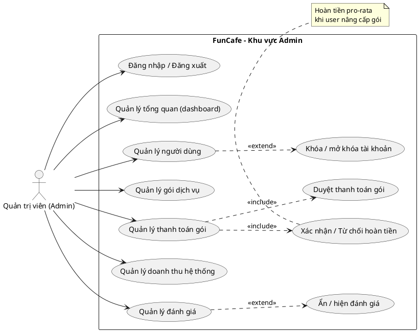
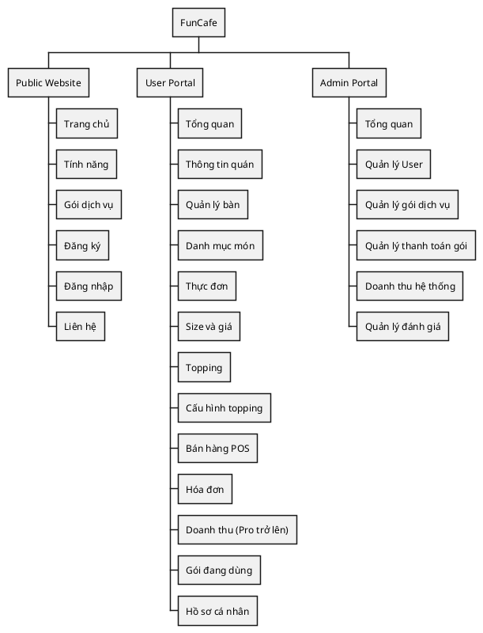

# FunCafe — Tài liệu sơ đồ (ERD, Use Case, Tổ chức giao diện)

> File này dùng để **vẽ sơ đồ**. Cách dùng nhanh:
> - **Mermaid** (ERD, sơ đồ giao diện): dán khối code vào https://mermaid.live → xuất PNG/SVG.
> - **PlantUML** (Use Case): dán vào https://www.plantuml.com/plantuml hoặc plugin draw.io/VS Code.
>
> Dữ liệu lấy đúng theo mục 3.3 của báo cáo. CSDL là **MongoDB** nên "FK" là tham chiếu logic (lưu dạng ObjectId/string), không ràng buộc cứng như SQL.

---

## 1. ERD — Chi tiết các bảng và thành phần

Ký hiệu: **PK** = khóa chính, **FK** = khóa ngoại (tham chiếu), **UK** = duy nhất (unique), **NN** = bắt buộc (not null).

### 1.1 users — Tài khoản (chủ quán & admin)
| Cột | Kiểu | Ràng buộc | Ghi chú |
|---|---|---|---|
| id | ObjectId | PK | ID tài khoản |
| full_name | String | NN | Họ tên |
| email | String | UK | Email đăng nhập |
| password | String | Hash | Mật khẩu đã mã hóa |
| phone | String | Nullable | Số điện thoại |
| avatar | String | Nullable | Ảnh đại diện |
| role | String | user/admin | Vai trò |
| status | String | active/locked | Trạng thái |
| has_used_free_trial | Boolean | Default false | Đã dùng thử chưa |
| created_at | Date | Default now | Ngày tạo |
| updated_at | Date | Default now | Ngày cập nhật |

### 1.2 packages — Gói dịch vụ
| Cột | Kiểu | Ràng buộc | Ghi chú |
|---|---|---|---|
| id | ObjectId | PK | ID gói |
| name | String | NN | Tên gói |
| type | String | free/pro/promax | Loại gói |
| level | Number | NN | Cấp độ so sánh nâng cấp (free=0, pro=1, promax=2) |
| description | String | Nullable | Mô tả |
| is_trial | Boolean | Default false | Có phải gói dùng thử |
| max_tables | Number | Nullable | Số bàn tối đa (null = không giới hạn) |
| max_menu_items | Number | Nullable | Số món tối đa (null = không giới hạn) |
| can_use_ai | Boolean | Default false | Có trợ lý AI |
| features | Array | Nullable | Danh sách tính năng |
| status | String | active/inactive | Trạng thái |
| created_at | Date | Default now | Ngày tạo |
| updated_at | Date | Default now | Ngày cập nhật |

### 1.3 time_subscriptions — Thời hạn & giá theo gói
| Cột | Kiểu | Ràng buộc | Ghi chú |
|---|---|---|---|
| id | ObjectId | PK | ID thời hạn |
| package_id | ObjectId | FK → packages | Gói tương ứng |
| duration_value | Number | NN | Số lượng thời gian |
| duration_unit | String | day/month | Đơn vị |
| price | Number | >= 0 | Giá |
| label | String | NN | Nhãn hiển thị |
| status | String | active/inactive | Trạng thái |
| created_at | Date | Default now | Ngày tạo |
| updated_at | Date | Default now | Ngày cập nhật |

### 1.4 subscriptions — Đăng ký gói của user
| Cột | Kiểu | Ràng buộc | Ghi chú |
|---|---|---|---|
| id | ObjectId | PK | ID subscription |
| user_id | ObjectId | FK → users | User đăng ký |
| package_id | ObjectId | FK → packages | Gói đăng ký |
| time_subscription_id | ObjectId | FK → time_subscriptions | Thời hạn |
| package_name_snapshot | String | NN | Tên gói tại thời điểm đăng ký |
| start_date | Date | NN | Ngày bắt đầu |
| end_date | Date | NN | Ngày hết hạn |
| status | String | active/expired/cancelled/rejected | Trạng thái |
| subtotal | Number | Default 0 | Tạm tính |
| total_amount | Number | Default 0 | Tổng tiền |
| action_type | String | new/renew/upgrade | Loại thao tác |
| previous_subscription_id | ObjectId | Nullable | Sub cũ khi nâng cấp (khôi phục nếu bị từ chối) |
| is_pending_review | Boolean | Default false | Đang dùng nhưng chờ admin duyệt |
| created_at | Date | Default now | Ngày tạo |
| updated_at | Date | Default now | Ngày cập nhật |

### 1.5 package_payments — Thanh toán gói (+ hoàn tiền)
| Cột | Kiểu | Ràng buộc | Ghi chú |
|---|---|---|---|
| id | ObjectId | PK | ID thanh toán |
| user_id | ObjectId | FK → users | User thanh toán |
| package_id | ObjectId | FK → packages | Gói |
| subscription_id | ObjectId | FK → subscriptions | Subscription liên quan |
| amount | Number | >= 0 | Số tiền |
| payment_method | String | cash/bank_transfer/qr_code/e_wallet | Phương thức |
| payment_status | String | pending/paid/failed/rejected | Trạng thái |
| transaction_code | String | Nullable (UK) | Mã giao dịch |
| paid_at | Date | Nullable | Ngày xác nhận |
| action_type | String | new/renew/upgrade | Loại giao dịch |
| previous_subscription_id | ObjectId | Nullable | Rollback khi từ chối nâng cấp |
| previous_end_date | Date | Nullable | Rollback khi từ chối gia hạn |
| refund_amount | Number | Default 0 | Tiền hoàn phần còn lại của gói cũ khi nâng cấp |
| refund_status | String | none/pending/approved/rejected | Trạng thái hoàn tiền (chờ admin) |
| refund_note | String | Nullable | Ghi chú hoàn tiền |
| refunded_at | Date | Nullable | Thời điểm admin xác nhận hoàn |
| created_at | Date | Default now | Ngày tạo |
| updated_at | Date | Default now | Ngày cập nhật |

### 1.6 cafes — Quán cafe
| Cột | Kiểu | Ràng buộc | Ghi chú |
|---|---|---|---|
| id | ObjectId | PK | ID quán |
| user_id | ObjectId | FK → users | Chủ quán (mỗi user 1 quán) |
| name | String | NN | Tên quán |
| address | String | Nullable | Địa chỉ |
| phone | String | Nullable | Số điện thoại |
| description | String | Nullable | Mô tả |
| logo | String | Nullable | Logo |
| status | String | active/inactive | Trạng thái |

### 1.7 tables — Bàn
| Cột | Kiểu | Ràng buộc | Ghi chú |
|---|---|---|---|
| id | ObjectId | PK | ID bàn |
| cafe_id | ObjectId | FK → cafes | Quán |
| name | String | NN | Tên bàn |
| capacity | Number | Default 1 | Sức chứa |
| display_order | Number | Default 0 | Thứ tự |
| status | String | empty/serving/reserved/cleaning | Trạng thái |
| current_order_id | ObjectId | Nullable (FK → orders) | Order hiện tại |

> **Ghi chú thiết kế:** `current_order_id` là **con trỏ nhanh** tới đơn đang mở của bàn (tránh phải truy vấn `orders` mỗi lần hiển thị sơ đồ bàn). Nó **khác** quan hệ lịch sử `orders.table_id` (một bàn có nhiều đơn theo thời gian). Tính nhất quán do tầng service đảm bảo, không phải vòng lặp dữ liệu.

### 1.8 categories — Danh mục món
| Cột | Kiểu | Ràng buộc | Ghi chú |
|---|---|---|---|
| id | ObjectId | PK | ID danh mục |
| cafe_id | ObjectId | FK → cafes | Quán |
| name | String | NN | Tên danh mục |
| description | String | Nullable | Mô tả |
| is_active | Boolean | Default true | Trạng thái |

### 1.9 items — Món
| Cột | Kiểu | Ràng buộc | Ghi chú |
|---|---|---|---|
| id | ObjectId | PK | ID món |
| cafe_id | ObjectId | FK → cafes | Quán |
| category_id | ObjectId | FK → categories | Danh mục |
| name | String | NN | Tên món |
| description | String | Nullable | Mô tả |
| image | String | Nullable | Hình ảnh |
| base_price | Number | >= 0 | Giá mặc định (món không size) |
| has_size | Boolean | Default false | Có size không |
| allow_topping | Boolean | Default false | Cho topping không |
| is_available | Boolean | Default true | Còn bán không |
| display_order | Number | Default 0 | Thứ tự |

### 1.10 (Ghi chú) Size — không tạo bảng riêng
> **Không có collection `sizes`.** Size được lưu **denormalized** trực tiếp bằng trường `size_name` trong `item_prices` (mỗi dòng giá là một size). Vì vậy **không có thực thể `sizes` trong ERD** — đừng tìm bảng này trong sơ đồ.

### 1.11 item_prices — Giá theo size
| Cột | Kiểu | Ràng buộc | Ghi chú |
|---|---|---|---|
| id | ObjectId | PK | ID giá |
| item_id | ObjectId | FK → items | Món |
| size_name | String | NN | Tên size lúc bán (S/M/L...) |
| price | Number | >= 0 | Giá theo size |
| is_active | Boolean | Default true | Trạng thái |

### 1.12 toppings — Topping
| Cột | Kiểu | Ràng buộc | Ghi chú |
|---|---|---|---|
| id | ObjectId | PK | ID topping |
| cafe_id | ObjectId | FK → cafes | Quán |
| name | String | NN | Tên topping |
| price | Number | >= 0 | Giá topping |
| image | String | Nullable | Hình ảnh |
| is_available | Boolean | Default true | Trạng thái |

### 1.13 item_toppings — Topping hợp lệ cho món (N–N)
| Cột | Kiểu | Ràng buộc | Ghi chú |
|---|---|---|---|
| id | ObjectId | PK | ID liên kết |
| item_id | ObjectId | FK → items | Món |
| topping_id | ObjectId | FK → toppings | Topping |
| created_at | Date | Default now | Ngày tạo |
| updated_at | Date | Default now | Ngày cập nhật |

### 1.14 orders — Đơn bán hàng
| Cột | Kiểu | Ràng buộc | Ghi chú |
|---|---|---|---|
| id | ObjectId | PK | ID order |
| cafe_id | ObjectId | FK → cafes | Quán |
| table_id | ObjectId | FK → tables | Bàn |
| code | String | UK (theo quán) | Mã order |
| status | String | active/paid/cancelled | Trạng thái |
| subtotal | Number | Default 0 | Tạm tính |
| discount_amount | Number | Default 0 | Giảm giá |
| total_amount | Number | Default 0 | Tổng tiền |
| paid_at | Date | Nullable | Ngày thanh toán |

> **Ghi chú thiết kế:** order có **cả `cafe_id` lẫn `table_id`** dù bàn đã thuộc quán. `cafe_id` là **denormalize cố ý** để truy vấn "đơn/doanh thu theo quán" mà không phải join 2 cấp (order → table → cafe) — đánh đổi lưu trùng lấy tốc độ đọc.

### 1.15 order_details — Dòng món trong order
| Cột | Kiểu | Ràng buộc | Ghi chú |
|---|---|---|---|
| id | ObjectId | PK | ID dòng món |
| order_id | ObjectId | FK → orders | Order |
| item_id | ObjectId | FK → items | Món |
| item_price_id | ObjectId | Nullable (FK → item_prices) | Giá size |
| item_name_snapshot | String | NN | Tên món lúc bán |
| size_name_snapshot | String | Nullable | Tên size lúc bán |
| quantity | Number | > 0 | Số lượng |
| unit_price | Number | >= 0 | Đơn giá |
| subtotal | Number | >= 0 | Tiền món chính |
| topping_total | Number | >= 0 | Tổng topping |
| total_price | Number | >= 0 | Tổng dòng |
| note | String | Nullable | Ghi chú dòng món |

### 1.16 order_detail_toppings — Topping của từng dòng món
| Cột | Kiểu | Ràng buộc | Ghi chú |
|---|---|---|---|
| id | ObjectId | PK | ID topping dòng |
| order_detail_id | ObjectId | FK → order_details | Dòng món |
| topping_id | ObjectId | FK → toppings | Topping |
| topping_name_snapshot | String | NN | Tên topping lúc bán |
| quantity | Number | > 0 | Số lượng topping/món |
| price_at_time | Number | >= 0 | Giá lúc bán |
| subtotal | Number | >= 0 | Thành tiền topping |

### 1.17 invoices — Hóa đơn (snapshot)
| Cột | Kiểu | Ràng buộc | Ghi chú |
|---|---|---|---|
| id | ObjectId | PK | ID hóa đơn |
| invoice_code | String | UK | Mã hóa đơn |
| order_id | ObjectId | FK → orders | Order (1–1) |
| cafe_id | ObjectId | FK → cafes | Quán |
| table_id | ObjectId | FK → tables | Bàn |
| cafe_snapshot | Object | NN | Snapshot quán |
| table_snapshot | Object | NN | Snapshot bàn |
| items | Array | NN | Snapshot các món |
| subtotal | Number | >= 0 | Tạm tính |
| discount_amount | Number | Default 0 | Giảm giá |
| total_amount | Number | >= 0 | Tổng tiền |
| payment_method | String | NN | Phương thức |
| payment_status | String | paid/refunded | Trạng thái |

> **Ghi chú thiết kế (quan trọng khi bảo vệ):** invoice **cố ý lưu trùng** — vừa giữ `order_id`/`cafe_id`/`table_id` (để truy vấn) vừa chụp `cafe_snapshot`/`table_snapshot`/`items[]` (để **hiển thị bất biến**). Hóa đơn là **ảnh chụp tại thời điểm thanh toán**: sau này quán đổi tên, món đổi giá hay bị xóa thì hóa đơn cũ **không đổi**. Đây là phi chuẩn hóa có chủ đích để đảm bảo toàn vẹn lịch sử — chuẩn ngành (giống hóa đơn PDF), không phải lỗi thiết kế.

### 1.18 reviews — Đánh giá dịch vụ FunCafe
> Đây là **chủ quán đánh giá nền tảng FunCafe**, KHÔNG phải khách đánh giá món; hóa đơn không chứa link review.

| Cột | Kiểu | Ràng buộc | Ghi chú |
|---|---|---|---|
| id | ObjectId | PK | ID đánh giá |
| user_id | ObjectId | FK → users | User (chủ quán) đánh giá FunCafe |
| cafe_id | ObjectId | Nullable | Quán tại thời điểm đánh giá |
| package_id | ObjectId | Nullable (FK → packages) | Gói đang dùng khi đánh giá |
| rating | Number | 1–5 | Điểm tổng thể |
| title | String | Nullable | Tiêu đề |
| comment | String | Nullable | Nội dung góp ý |
| status | String | visible/hidden | Trạng thái hiển thị |
| created_at | Date | Default now | Ngày tạo |
| updated_at | Date | Default now | Ngày cập nhật |

### Bản số quan hệ chi tiết (min..max)

**Chú giải bản số** (ghi ở phía "con" — tức mỗi bản ghi bên trái ứng với bao nhiêu bản ghi bên phải):

| Ký hiệu | Nghĩa | Bắt buộc? |
|---|---|---|
| **1** | Đúng một (1..1) | Bắt buộc |
| **0..1** | Không hoặc một | Tùy chọn |
| **1..N** | Một hoặc nhiều | Bắt buộc + nhiều |
| **0..N** | Không, một hoặc nhiều | Tùy chọn + nhiều |

**Chú giải ký hiệu crow's foot trong Mermaid** (`A <bên A>--<bên B> B`):

| Ký hiệu | Đọc | Tương đương |
|---|---|---|
| `\|\|` | một và chỉ một | 1 |
| `o\|` | không hoặc một | 0..1 |
| `\|{` | một hoặc nhiều | 1..N |
| `o{` | không hoặc nhiều | 0..N |

**Bảng bản số từng quan hệ** (đọc: *một* bản ghi Bên A ứng với *bao nhiêu* Bên B, và ngược lại):

| # | Bên A | ↔ | Bên B | A ⟶ B | B ⟶ A | Vì sao |
|---|---|---|---|---|---|---|
| 1 | users | — | cafes | **0..1** | **1** | User mới đăng ký **chưa có quán** cho tới khi tạo; mỗi quán thuộc đúng 1 chủ (`cafes.user_id` NN). Mỗi user tối đa 1 quán. |
| 2 | users | — | subscriptions | **0..N** | **1** | User có thể chưa đăng ký gói nào (0), hoặc nhiều lần đăng ký/gia hạn/nâng cấp (N). |
| 3 | users | — | package_payments | **0..N** | **1** | Mỗi lần thanh toán gói là 1 bản ghi; user chưa mua thì 0. |
| 4 | users | — | reviews | **0..N** | **1** | Chủ quán có thể chưa đánh giá (0) hoặc đánh giá nhiều lần (N). |
| 5 | packages | — | time_subscriptions | **1..N** | **1** | Mỗi gói có ≥1 mốc thời hạn (Free: 7 ngày; Pro/Pro Max: 1/3/12 tháng). Mỗi mốc thuộc đúng 1 gói (`package_id` NN). |
| 6 | packages | — | subscriptions | **0..N** | **1** | Một gói có thể chưa ai đăng ký (0) hoặc được nhiều user đăng ký (N). |
| 7 | packages | — | package_payments | **0..N** | **1** | Tương tự — gói được thanh toán nhiều lần. |
| 8 | packages | — | reviews | **0..N** | **0..1** | `reviews.package_id` **nullable** → một đánh giá có thể không gắn gói (0..1); mỗi gói có 0..N đánh giá. |
| 9 | time_subscriptions | — | subscriptions | **0..N** | **0..1** | `subscriptions.time_subscription_id` **nullable** (gói Free dùng thử không cần mốc giá) → sub gắn 0..1 mốc; mỗi mốc dùng cho 0..N sub. |
| 10 | subscriptions | — | package_payments | **1..N** | **1** | Mỗi subscription phát sinh ≥1 giao dịch (tạo mới), có thể thêm khi gia hạn (N). |
| 11 | subscriptions | — | subscriptions (self) | **0..1** | **0..1** | `previous_subscription_id` trỏ về sub cũ khi **nâng cấp/gia hạn** (rollback nếu bị từ chối). Sub đầu tiên = null. |
| 12 | cafes | — | tables | **0..N** | **1** | Quán mới chưa có bàn (0); mỗi bàn thuộc 1 quán. *(Gói Pro: tối đa 10 bàn — ràng buộc nghiệp vụ, không phải ràng buộc lược đồ.)* |
| 13 | cafes | — | categories | **0..N** | **1** | Quán có 0..N danh mục món. |
| 14 | cafes | — | items | **0..N** | **1** | Quán có 0..N món. *(Gói Pro: tối đa 15 món.)* |
| 15 | cafes | — | toppings | **0..N** | **1** | Quán có 0..N topping. |
| 16 | cafes | — | orders | **0..N** | **1** | Quán phát sinh 0..N đơn bán. |
| 17 | cafes | — | invoices | **0..N** | **1** | Quán xuất 0..N hóa đơn. |
| 18 | categories | — | items | **0..N** | **1** | Danh mục có 0..N món; mỗi món thuộc đúng 1 danh mục (`category_id` NN). |
| 19 | items | — | item_prices | **0..N** | **1** | Món **không size** ⟶ 0 dòng giá (dùng `base_price`); món **có size** ⟶ N dòng giá. |
| 20 | items | — | toppings | **N — N** | qua `item_toppings` | Nhiều-nhiều: 1 món cho nhiều topping, 1 topping dùng cho nhiều món. Bảng nối `item_toppings`: mỗi phía **1**, mỗi món/topping có **0..N** bản ghi nối. |
| 21 | items | — | order_details | **0..N** | **1** | Món được gọi trong 0..N dòng order; mỗi dòng trỏ 1 món (`item_id`). |
| 22 | tables | — | orders | **0..N** | **1** | Bàn phục vụ 0..N đơn (theo thời gian); mỗi đơn thuộc 1 bàn (`table_id`). |
| 23 | tables | — | orders (current) | **0..1** | **0..1** | `tables.current_order_id` **nullable**: bàn đang có **0 hoặc 1** đơn hoạt động; một đơn là "đơn hiện tại" của 0..1 bàn. |
| 24 | orders | — | invoices | **0..1** | **1** | `hasOne`: đơn `active`/`cancelled` chưa có hóa đơn (0); đơn đã `paid` ⟶ đúng 1 hóa đơn. Mỗi hóa đơn thuộc 1 đơn (`order_id` NN). **← không phải 1—1 bắt buộc.** |
| 25 | orders | — | order_details | **1..N** | **1** | Mỗi đơn gồm ≥1 dòng món (không tạo đơn rỗng); mỗi dòng thuộc 1 đơn. |
| 26 | order_details | — | order_detail_toppings | **0..N** | **1** | Dòng món có 0..N topping kèm theo. |
| 27 | order_details | — | item_prices | **0..1** | **0..N** | `item_price_id` **nullable** (món không size = null); mỗi dòng trỏ 0..1 dòng giá size. |
| 28 | toppings | — | order_detail_toppings | **0..N** | **1** | Topping xuất hiện trong 0..N dòng-topping đã bán. |
| 29 | cafes | — | reviews | **0..N** | **0..1** | `reviews.cafe_id` **nullable** (đánh giá nền tảng, quán tại thời điểm đánh giá; quán có thể đã bị xóa) → mỗi đánh giá gắn 0..1 quán; một quán có 0..N đánh giá. |
| 30 | tables | — | invoices | **0..N** | **1** | `invoices.table_id`: hóa đơn được in cho đúng 1 bàn; mỗi bàn có 0..N hóa đơn theo thời gian (snapshot lưu kèm `table_snapshot`). |

> **Quy ước quan trọng:** CSDL là **MongoDB** nên "FK" là **tham chiếu logic** (lưu ObjectId/string), *không* có ràng buộc khóa ngoại cứng như SQL. Các bản số ở trên là **ngữ nghĩa nghiệp vụ** của ứng dụng (do tầng code Laravel/service đảm bảo), không phải ràng buộc do DBMS ép.
>
> Các giới hạn **10 bàn / 15 món của gói Pro** là **ràng buộc nghiệp vụ** (kiểm ở `EnforcesPackageLimits`), không thể hiện trong lược đồ ERD.

---

## 2. ERD — Sơ đồ Mermaid theo 3 cụm (dán vào mermaid.live)

> Thay vì 1 sơ đồ 18 bảng, chia thành **3 cụm domain** cho dễ trình bày. Ký hiệu bản số: `o|`=0..1, `||`=1, `o{`=0..N, `|{`=1..N.
> Hộp **không có thuộc tính** trong một cụm là thực thể **cầu nối** đã định nghĩa đầy đủ ở cụm khác (chỉ vẽ để thể hiện quan hệ liên cụm).

### Cụm A — Tài khoản & Gói dịch vụ

### Cụm B — Quán & Thực đơn

> `users`, `reviews` là **hộp cầu nối** (định nghĩa đầy đủ ở Cụm A).

### Cụm C — Bán hàng

> `cafes`, `tables`, `items`, `item_prices`, `toppings` là **hộp cầu nối** (định nghĩa đầy đủ ở Cụm B). `sizes` không có trong ERD (denormalized thành `item_prices.size_name`).

---

## 3. Use Case — phần USER (Chủ quán)

> Hệ thống chỉ có 2 tác nhân: **Chủ quán (User)** và **Quản trị viên (Admin)**.
> Khách hàng của quán cafe **không phải tác nhân** — họ không đăng nhập/không dùng hệ thống (chủ quán phục vụ qua POS, khách chỉ quét mã VietQR của ngân hàng để chuyển khoản).

### PlantUML

---

## 4. Use Case — phần ADMIN

### PlantUML

---

## 5. Sơ đồ tổ chức giao diện

### Mermaid (dán vào mermaid.live)

```mermaid
flowchart TD
    ROOT["FunCafe"]
    ROOT --> PUB["Public Website"]
    ROOT --> USR["User Portal (Chủ quán)"]
    ROOT --> ADM["Admin Portal"]

    PUB --> P1["Trang chủ"]
    PUB --> P2["Tính năng"]
    PUB --> P3["Gói dịch vụ"]
    PUB --> P4["Đăng ký"]
    PUB --> P5["Đăng nhập"]
    PUB --> P6["Liên hệ"]

    USR --> U1["Tổng quan"]
    USR --> U2["Thông tin quán"]
    USR --> U3["Quản lý bàn"]
    USR --> U4["Danh mục món"]
    USR --> U5["Thực đơn"]
    USR --> U6["Size và giá theo size"]
    USR --> U7["Topping"]
    USR --> U8["Cấu hình topping"]
    USR --> U9["Bán hàng POS"]
    USR --> U11["Hóa đơn"]
    USR --> U12["Doanh thu (Pro trở lên)"]
    USR --> U13["Gói đang dùng"]
    USR --> U14["Hồ sơ cá nhân"]

    ADM --> A1["Tổng quan"]
    ADM --> A2["Quản lý User"]
    ADM --> A3["Quản lý gói dịch vụ"]
    ADM --> A5["Quản lý thanh toán gói"]
    ADM --> A6["Doanh thu hệ thống"]
    ADM --> A7["Quản lý đánh giá"]
```

### PlantUML (bản thay thế, dạng cây WBS)

---

## 6. Phụ lục — Câu hỏi bảo vệ & cách trả lời

> Chuẩn bị sẵn cho buổi bảo vệ ERD. Mỗi câu nêu **ý chốt** để trả lời gọn, tự tin.

**Q1. MongoDB là NoSQL, sao lại vẽ ERD và "khóa ngoại"?**
ERD ở đây mô hình hóa **quan hệ nghiệp vụ**. MongoDB không ép ràng buộc khóa ngoại cứng như SQL, nhưng vẫn có **tham chiếu logic** (lưu `ObjectId` trỏ sang collection khác). Em chọn **tham chiếu** cho các thực thể lớn/độc lập (users, items, orders — cần truy vấn riêng) và **nhúng** cho dữ liệu luôn đi cùng cha & cần bất biến (ví dụ `invoices.items[]`). Tính toàn vẹn tham chiếu do tầng service (Laravel) đảm bảo.

**Q2. Sao không nhúng `order_details` vào `orders` như phong cách Mongo?**
Vì `order_details` cần **truy vấn/thống kê độc lập** (top món bán chạy, doanh thu theo món) — nhúng sẽ khó tổng hợp chéo nhiều đơn. Ngược lại `invoices` thì **nhúng** `items[]` vì hóa đơn là bản chụp bất biến, không cần join. Đây là lựa chọn có cân nhắc theo cách dữ liệu được đọc.

**Q3. `orders.cafe_id` có thừa không (đã có `table_id`, bàn thuộc quán)?**
Có trùng, nhưng **cố ý denormalize**: để truy vấn "đơn/doanh thu theo quán" không phải join 2 cấp (order → table → cafe). Đánh đổi lưu trùng lấy tốc độ đọc — mẫu thường gặp trong hệ thống đọc nhiều.

**Q4. Snapshot (invoices, `*_name_snapshot`) có vi phạm chuẩn hóa không?**
Dữ liệu **vận hành** (users/items/orders) vẫn chuẩn hóa. Hóa đơn **cố ý phi chuẩn hóa** để đảm bảo **toàn vẹn lịch sử**: quán đổi tên, món đổi giá/bị xóa thì hóa đơn cũ không đổi. Đây là chuẩn ngành (giống hóa đơn PDF), là quyết định thiết kế chứ không phải sơ suất.

**Q5. `reviews` là ai đánh giá gì?**
Là **chủ quán đánh giá nền tảng FunCafe** (dịch vụ/giao diện/hỗ trợ) — KHÔNG phải khách đánh giá món. Vì vậy `reviews` gắn với `user` + `package` (gói đang dùng khi đánh giá) + `cafe` (nullable, quán lúc đánh giá), không liên quan `orders`/`invoices`.

**Q6. Vì sao vừa có `base_price` vừa có bảng `item_prices`?**
Món **không có size** dùng `base_price` (1 giá). Món **có size** (`has_size = true`) dùng nhiều dòng `item_prices` theo từng size. Cờ `has_size` quyết định đọc giá ở đâu — không phải "lưu giá 2 nơi trùng nhau".

**Q7. Sao nhiều bảng (18) thế?**
Chia theo **3 cụm domain** (Tài khoản & Gói / Quán & Thực đơn / Bán hàng), mỗi cụm 4–7 bảng, mỗi bảng **một trách nhiệm rõ**. So với hệ billing thực tế (Stripe có Product/Price/Subscription/Invoice/Charge/Refund…) thì 18 bảng là **gọn**. Trình bày kèm **một luồng ví dụ**: khách gọi món → `order` + `order_details` (+ topping) → thanh toán → `invoice`.

**Q8. Vì sao `tables` và `orders` tham chiếu 2 chiều?**
`orders.table_id` là quan hệ **lịch sử** (một bàn nhiều đơn theo thời gian). `tables.current_order_id` là **con trỏ nhanh** tới đơn đang mở (tránh truy vấn khi vẽ sơ đồ bàn). Hai vai trò khác nhau, nhất quán do tầng service — không phải vòng lặp dữ liệu.
